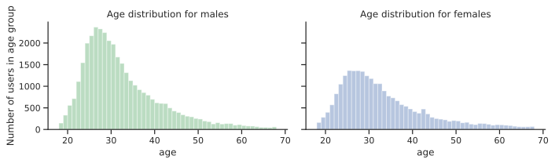
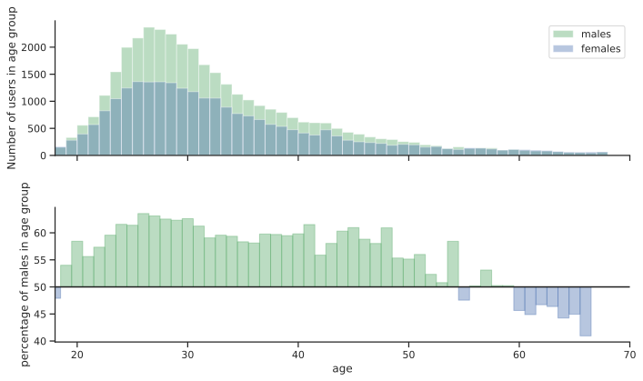
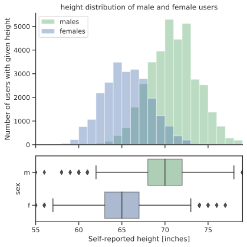
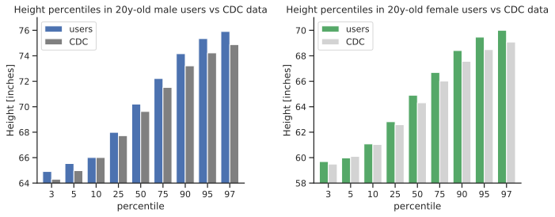
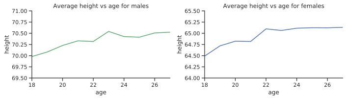
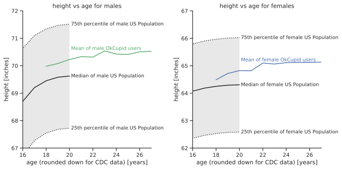
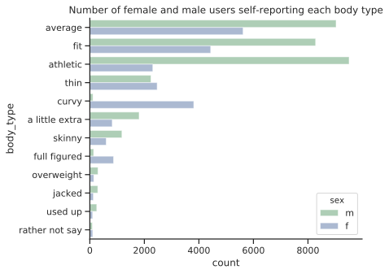
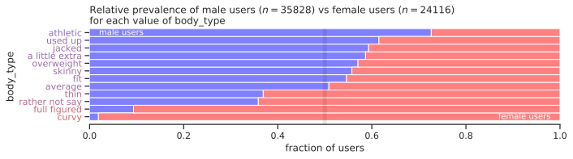
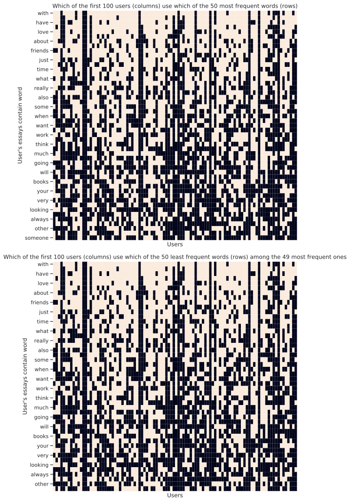

# OKCupid Dataset Use Case 2. Module 5. MAABD

This notebook contains an analysis of a public dataset of almost 60000 online dating profiles. The dataset has been published in the [Journal of Statistics Education](http://ww2.amstat.org/publications/jse/v23n2/kim.pdf), Volume 23, Number 2 (2015) by Albert Y. Kim et al., and its collection and distribution was explicitly allowed by OkCupid president and co-founder [Christian Rudder](http://blog.okcupid.com/). Using these data is therefore ethically and legally acceptable; this is in contrast to another recent release of a different [OkCupid profile dataset](http://www.vox.com/2016/5/12/11666116/70000-okcupid-users-data-release), which was collected without permission and without anonymizing the data (more on the ethical issues in this [Wired article](https://www.wired.com/2016/05/okcupid-study-reveals-perils-big-data-science/)).


```python
%matplotlib inline
%config InlineBackend.figure_format='svg'
from IPython.display import display,HTML
import pandas as pd
import seaborn as sns
from scipy.stats import kendalltau
import numpy as np
import math
import matplotlib.pyplot as plt

from prettypandas import PrettyPandas
sns.set(style="ticks")
sns.set_context(context="notebook",font_scale=1)

import string
import tqdm # a cool progress bar
import re
import json

import pymongo
from pymongo import MongoClient

```

### Dataset details

The data is available at this link. The codebook includes many details about the available fields. The dataset was collected by web scraping the OKCupid.com website on 2012/06/30, and includes almost 60k profiles of people within a 25 mile radius of San Francisco, who were online in the previous year (after 06/30/2011), with at least one profile picture.

The CSV contains a row (observation) for each profile. Let's have a look at the first 10 profiles, excluding the columns whose name contains the string "essay", which contain a lot of text and are not practical at the moment.


```python
d=pd.read_csv("/home/master/UseCase_OKCupid/profiles.csv")
print("The dataset contains {} records".format(len(d)))
```

    The dataset contains 59946 records


```python
########################################################### Database Connection and Load ############################
print('Mongo version', pymongo.__version__)
client = MongoClient('localhost', 27017)
db = client.test
collection = db.okcupid

#Import data into the database
collection.drop()
```

    Mongo version 3.9.0


```python
# Transform dataframe to Json and store in MongoDB
records = json.loads(d.to_json(orient='records'))
collection.delete_many({})
collection.insert_many(records)
```


    <pymongo.results.InsertManyResult at 0x7f632f4dafa0>


```python
#Check if you can access the data from the MongoDB.
cursor = collection.find().sort('sex',pymongo.ASCENDING).limit(1)
for doc in cursor:
    print(doc)
```

    {'_id': ObjectId('5e8b5fbd8dc350fdc7c09cc6'), 'age': 32, 'body_type': 'fit', 'diet': 'strictly anything', 'drinks': 'socially', 'drugs': 'never', 'education': 'graduated from college/university', 'essay0': "life is about the little things. i love to laugh. it's easy to do\nwhen one can find beauty and humor in the ugly. this perspective\nmakes for a more gratifying life. it's a gift. we are here to play.", 'essay1': 'digging up buried treasure', 'essay2': 'frolicking<br />\nwitty banter<br />\nusing my camera to extract sums of a whole and share my perspective\nwith the world in hopes of opening up theirs<br />\nbeing amused by things most people would miss', 'essay3': 'i am the last unicorn', 'essay4': "i like books. ones with pictures. reading them is great too. where\ndo people find the time? i spend more time with other people not\nreading. i collect books. they sit neatly on my bookshelves.<br />\n<br />\nmovies are great. especially on movie night. with brownies.<br />\n<br />\nmusic. i love (love) it all. unless it's country.<br />\n<br />\ni love food.", 'essay5': 'laughter<br />\namazing people in my life<br />\ncolor<br />\ncuriosity<br />\nmusic and rhythm<br />\na good pair of sunglasses', 'essay6': "synchronicity<br />\n<br />\nthere is this whole other realm where the fabrics of our life\nstories intersect as they dance and play in a magical burst of\nenergy. this realm doesn't need you to believe in it in order to\nmaintain. it is a cluster of synchronicities and happenings. it is\na gift to those who notice them. something to be treasured\nappreciated. there is something special in each and every moment\nthat you experience in your daily waking life. this something\nbrings us back to the age old question: if a tree falls in the\nforest and no one is there to hear it, does it make a sound? this\nworks in the same way. if you are not consciously there to hear it,\nsee it, taste it, smell it, feel it none of this matters, it's\nstill there. pay attention to the little things, those that are\noften overlooked. see if you can find the magic in this gift we\ncall life.", 'essay7': 'plotting to take over the world with my army of segway riding\npandas and fire breathing kittens', 'essay8': 'my typical friday night', 'essay9': None, 'ethnicity': 'white, other', 'height': 65.0, 'income': -1, 'job': None, 'last_online': '2012-06-25-20-45', 'location': 'san francisco, california', 'offspring': None, 'orientation': 'straight', 'pets': 'likes dogs and likes cats', 'religion': None, 'sex': 'f', 'sign': 'virgo', 'smokes': None, 'speaks': 'english', 'status': 'single'}


```python
pipeline = [
        {"$match": {"sex":"m"}},
]

aggResult = collection.aggregate(pipeline)
male = pd.DataFrame(list(aggResult))
male.head()
```


<div>
<style scoped>
    .dataframe tbody tr th:only-of-type {
        vertical-align: middle;
    }

    .dataframe tbody tr th {
        vertical-align: top;
    }

    .dataframe thead th {
        text-align: right;
    }
</style>
<table border="1" class="dataframe">
  <thead>
    <tr style="text-align: right;">
      <th></th>
      <th>_id</th>
      <th>age</th>
      <th>body_type</th>
      <th>diet</th>
      <th>drinks</th>
      <th>drugs</th>
      <th>education</th>
      <th>essay0</th>
      <th>essay1</th>
      <th>essay2</th>
      <th>...</th>
      <th>location</th>
      <th>offspring</th>
      <th>orientation</th>
      <th>pets</th>
      <th>religion</th>
      <th>sex</th>
      <th>sign</th>
      <th>smokes</th>
      <th>speaks</th>
      <th>status</th>
    </tr>
  </thead>
  <tbody>
    <tr>
      <th>0</th>
      <td>5e8b5fbd8dc350fdc7c09cc0</td>
      <td>22</td>
      <td>a little extra</td>
      <td>strictly anything</td>
      <td>socially</td>
      <td>never</td>
      <td>working on college/university</td>
      <td>about me:&lt;br /&gt;\n&lt;br /&gt;\ni would love to think...</td>
      <td>currently working as an international agent fo...</td>
      <td>making people laugh.&lt;br /&gt;\nranting about a go...</td>
      <td>...</td>
      <td>south san francisco, california</td>
      <td>doesn&amp;rsquo;t have kids, but might want them</td>
      <td>straight</td>
      <td>likes dogs and likes cats</td>
      <td>agnosticism and very serious about it</td>
      <td>m</td>
      <td>gemini</td>
      <td>sometimes</td>
      <td>english</td>
      <td>single</td>
    </tr>
    <tr>
      <th>1</th>
      <td>5e8b5fbd8dc350fdc7c09cc1</td>
      <td>35</td>
      <td>average</td>
      <td>mostly other</td>
      <td>often</td>
      <td>sometimes</td>
      <td>working on space camp</td>
      <td>i am a chef: this is what that means.&lt;br /&gt;\n1...</td>
      <td>dedicating everyday to being an unbelievable b...</td>
      <td>being silly. having ridiculous amonts of fun w...</td>
      <td>...</td>
      <td>oakland, california</td>
      <td>doesn&amp;rsquo;t have kids, but might want them</td>
      <td>straight</td>
      <td>likes dogs and likes cats</td>
      <td>agnosticism but not too serious about it</td>
      <td>m</td>
      <td>cancer</td>
      <td>no</td>
      <td>english (fluently), spanish (poorly), french (...</td>
      <td>single</td>
    </tr>
    <tr>
      <th>2</th>
      <td>5e8b5fbd8dc350fdc7c09cc2</td>
      <td>38</td>
      <td>thin</td>
      <td>anything</td>
      <td>socially</td>
      <td>None</td>
      <td>graduated from masters program</td>
      <td>i'm not ashamed of much, but writing public te...</td>
      <td>i make nerdy software for musicians, artists, ...</td>
      <td>improvising in different contexts. alternating...</td>
      <td>...</td>
      <td>san francisco, california</td>
      <td>None</td>
      <td>straight</td>
      <td>has cats</td>
      <td>None</td>
      <td>m</td>
      <td>pisces but it doesn&amp;rsquo;t matter</td>
      <td>no</td>
      <td>english, french, c++</td>
      <td>available</td>
    </tr>
    <tr>
      <th>3</th>
      <td>5e8b5fbd8dc350fdc7c09cc3</td>
      <td>23</td>
      <td>thin</td>
      <td>vegetarian</td>
      <td>socially</td>
      <td>None</td>
      <td>working on college/university</td>
      <td>i work in a library and go to school. . .</td>
      <td>reading things written by old dead people</td>
      <td>playing synthesizers and organizing books acco...</td>
      <td>...</td>
      <td>berkeley, california</td>
      <td>doesn&amp;rsquo;t want kids</td>
      <td>straight</td>
      <td>likes cats</td>
      <td>None</td>
      <td>m</td>
      <td>pisces</td>
      <td>no</td>
      <td>english, german (poorly)</td>
      <td>single</td>
    </tr>
    <tr>
      <th>4</th>
      <td>5e8b5fbd8dc350fdc7c09cc4</td>
      <td>29</td>
      <td>athletic</td>
      <td>None</td>
      <td>socially</td>
      <td>never</td>
      <td>graduated from college/university</td>
      <td>hey how's it going? currently vague on the pro...</td>
      <td>work work work work + play</td>
      <td>creating imagery to look at:&lt;br /&gt;\nhttp://bag...</td>
      <td>...</td>
      <td>san francisco, california</td>
      <td>None</td>
      <td>straight</td>
      <td>likes dogs and likes cats</td>
      <td>None</td>
      <td>m</td>
      <td>aquarius</td>
      <td>no</td>
      <td>english</td>
      <td>single</td>
    </tr>
  </tbody>
</table>
<p>5 rows × 32 columns</p>
</div>


```python
pipeline = [
        {"$match": {"sex":"f"}},
]

aggResult = collection.aggregate(pipeline)
female = pd.DataFrame(list(aggResult))
female.head(2)
```


<div>
<style scoped>
    .dataframe tbody tr th:only-of-type {
        vertical-align: middle;
    }

    .dataframe tbody tr th {
        vertical-align: top;
    }

    .dataframe thead th {
        text-align: right;
    }
</style>
<table border="1" class="dataframe">
  <thead>
    <tr style="text-align: right;">
      <th></th>
      <th>_id</th>
      <th>age</th>
      <th>body_type</th>
      <th>diet</th>
      <th>drinks</th>
      <th>drugs</th>
      <th>education</th>
      <th>essay0</th>
      <th>essay1</th>
      <th>essay2</th>
      <th>...</th>
      <th>location</th>
      <th>offspring</th>
      <th>orientation</th>
      <th>pets</th>
      <th>religion</th>
      <th>sex</th>
      <th>sign</th>
      <th>smokes</th>
      <th>speaks</th>
      <th>status</th>
    </tr>
  </thead>
  <tbody>
    <tr>
      <th>0</th>
      <td>5e8b5fbd8dc350fdc7c09cc6</td>
      <td>32</td>
      <td>fit</td>
      <td>strictly anything</td>
      <td>socially</td>
      <td>never</td>
      <td>graduated from college/university</td>
      <td>life is about the little things. i love to lau...</td>
      <td>digging up buried treasure</td>
      <td>frolicking&lt;br /&gt;\nwitty banter&lt;br /&gt;\nusing my...</td>
      <td>...</td>
      <td>san francisco, california</td>
      <td>None</td>
      <td>straight</td>
      <td>likes dogs and likes cats</td>
      <td>None</td>
      <td>f</td>
      <td>virgo</td>
      <td>None</td>
      <td>english</td>
      <td>single</td>
    </tr>
    <tr>
      <th>1</th>
      <td>5e8b5fbd8dc350fdc7c09cc7</td>
      <td>31</td>
      <td>average</td>
      <td>mostly anything</td>
      <td>socially</td>
      <td>never</td>
      <td>graduated from college/university</td>
      <td>None</td>
      <td>writing. meeting new people, spending time wit...</td>
      <td>remembering people's birthdays, sending cards,...</td>
      <td>...</td>
      <td>san francisco, california</td>
      <td>doesn&amp;rsquo;t have kids, but wants them</td>
      <td>straight</td>
      <td>likes dogs and likes cats</td>
      <td>christianity</td>
      <td>f</td>
      <td>sagittarius</td>
      <td>no</td>
      <td>english, spanish (okay)</td>
      <td>single</td>
    </tr>
  </tbody>
</table>
<p>2 rows × 32 columns</p>
</div>


#### Sex Distribution


```python
print("{} males ({:.1%}), {} females ({:.1%})".format(
    len(male),len(male)/len(d),
    len(female),len(female)/len(d)))
```

    35829 males (59.8%), 24117 females (40.2%)


```python
 # Ignore columns with "essay" in the name (they are long)
PrettyPandas(d                                   # Prettyprints pandas dataframes
    .head(10)                                    # Sample the first 10 rows
    [[c for c in d.columns if "essay" not in c]]) # Ignore columns with "essay" in the name (they are long)

```


<style  type="text/css" >
</style><table id="T_e8be0342_7827_11ea_b14d_79e9b58f403b" ><thead>    <tr>        <th class="blank level0" ></th>        <th class="col_heading level0 col0" >age</th>        <th class="col_heading level0 col1" >body_type</th>        <th class="col_heading level0 col2" >diet</th>        <th class="col_heading level0 col3" >drinks</th>        <th class="col_heading level0 col4" >drugs</th>        <th class="col_heading level0 col5" >education</th>        <th class="col_heading level0 col6" >ethnicity</th>        <th class="col_heading level0 col7" >height</th>        <th class="col_heading level0 col8" >income</th>        <th class="col_heading level0 col9" >job</th>        <th class="col_heading level0 col10" >last_online</th>        <th class="col_heading level0 col11" >location</th>        <th class="col_heading level0 col12" >offspring</th>        <th class="col_heading level0 col13" >orientation</th>        <th class="col_heading level0 col14" >pets</th>        <th class="col_heading level0 col15" >religion</th>        <th class="col_heading level0 col16" >sex</th>        <th class="col_heading level0 col17" >sign</th>        <th class="col_heading level0 col18" >smokes</th>        <th class="col_heading level0 col19" >speaks</th>        <th class="col_heading level0 col20" >status</th>    </tr></thead><tbody>
                <tr>
                        <th id="T_e8be0342_7827_11ea_b14d_79e9b58f403blevel0_row0" class="row_heading level0 row0" >0</th>
                        <td id="T_e8be0342_7827_11ea_b14d_79e9b58f403brow0_col0" class="data row0 col0" >22</td>
                        <td id="T_e8be0342_7827_11ea_b14d_79e9b58f403brow0_col1" class="data row0 col1" >a little extra</td>
                        <td id="T_e8be0342_7827_11ea_b14d_79e9b58f403brow0_col2" class="data row0 col2" >strictly anything</td>
                        <td id="T_e8be0342_7827_11ea_b14d_79e9b58f403brow0_col3" class="data row0 col3" >socially</td>
                        <td id="T_e8be0342_7827_11ea_b14d_79e9b58f403brow0_col4" class="data row0 col4" >never</td>
                        <td id="T_e8be0342_7827_11ea_b14d_79e9b58f403brow0_col5" class="data row0 col5" >working on college/university</td>
                        <td id="T_e8be0342_7827_11ea_b14d_79e9b58f403brow0_col6" class="data row0 col6" >asian, white</td>
                        <td id="T_e8be0342_7827_11ea_b14d_79e9b58f403brow0_col7" class="data row0 col7" >75.000000</td>
                        <td id="T_e8be0342_7827_11ea_b14d_79e9b58f403brow0_col8" class="data row0 col8" >-1</td>
                        <td id="T_e8be0342_7827_11ea_b14d_79e9b58f403brow0_col9" class="data row0 col9" >transportation</td>
                        <td id="T_e8be0342_7827_11ea_b14d_79e9b58f403brow0_col10" class="data row0 col10" >2012-06-28-20-30</td>
                        <td id="T_e8be0342_7827_11ea_b14d_79e9b58f403brow0_col11" class="data row0 col11" >south san francisco, california</td>
                        <td id="T_e8be0342_7827_11ea_b14d_79e9b58f403brow0_col12" class="data row0 col12" >doesn&rsquo;t have kids, but might want them</td>
                        <td id="T_e8be0342_7827_11ea_b14d_79e9b58f403brow0_col13" class="data row0 col13" >straight</td>
                        <td id="T_e8be0342_7827_11ea_b14d_79e9b58f403brow0_col14" class="data row0 col14" >likes dogs and likes cats</td>
                        <td id="T_e8be0342_7827_11ea_b14d_79e9b58f403brow0_col15" class="data row0 col15" >agnosticism and very serious about it</td>
                        <td id="T_e8be0342_7827_11ea_b14d_79e9b58f403brow0_col16" class="data row0 col16" >m</td>
                        <td id="T_e8be0342_7827_11ea_b14d_79e9b58f403brow0_col17" class="data row0 col17" >gemini</td>
                        <td id="T_e8be0342_7827_11ea_b14d_79e9b58f403brow0_col18" class="data row0 col18" >sometimes</td>
                        <td id="T_e8be0342_7827_11ea_b14d_79e9b58f403brow0_col19" class="data row0 col19" >english</td>
                        <td id="T_e8be0342_7827_11ea_b14d_79e9b58f403brow0_col20" class="data row0 col20" >single</td>
            </tr>
            <tr>
                        <th id="T_e8be0342_7827_11ea_b14d_79e9b58f403blevel0_row1" class="row_heading level0 row1" >1</th>
                        <td id="T_e8be0342_7827_11ea_b14d_79e9b58f403brow1_col0" class="data row1 col0" >35</td>
                        <td id="T_e8be0342_7827_11ea_b14d_79e9b58f403brow1_col1" class="data row1 col1" >average</td>
                        <td id="T_e8be0342_7827_11ea_b14d_79e9b58f403brow1_col2" class="data row1 col2" >mostly other</td>
                        <td id="T_e8be0342_7827_11ea_b14d_79e9b58f403brow1_col3" class="data row1 col3" >often</td>
                        <td id="T_e8be0342_7827_11ea_b14d_79e9b58f403brow1_col4" class="data row1 col4" >sometimes</td>
                        <td id="T_e8be0342_7827_11ea_b14d_79e9b58f403brow1_col5" class="data row1 col5" >working on space camp</td>
                        <td id="T_e8be0342_7827_11ea_b14d_79e9b58f403brow1_col6" class="data row1 col6" >white</td>
                        <td id="T_e8be0342_7827_11ea_b14d_79e9b58f403brow1_col7" class="data row1 col7" >70.000000</td>
                        <td id="T_e8be0342_7827_11ea_b14d_79e9b58f403brow1_col8" class="data row1 col8" >80000</td>
                        <td id="T_e8be0342_7827_11ea_b14d_79e9b58f403brow1_col9" class="data row1 col9" >hospitality / travel</td>
                        <td id="T_e8be0342_7827_11ea_b14d_79e9b58f403brow1_col10" class="data row1 col10" >2012-06-29-21-41</td>
                        <td id="T_e8be0342_7827_11ea_b14d_79e9b58f403brow1_col11" class="data row1 col11" >oakland, california</td>
                        <td id="T_e8be0342_7827_11ea_b14d_79e9b58f403brow1_col12" class="data row1 col12" >doesn&rsquo;t have kids, but might want them</td>
                        <td id="T_e8be0342_7827_11ea_b14d_79e9b58f403brow1_col13" class="data row1 col13" >straight</td>
                        <td id="T_e8be0342_7827_11ea_b14d_79e9b58f403brow1_col14" class="data row1 col14" >likes dogs and likes cats</td>
                        <td id="T_e8be0342_7827_11ea_b14d_79e9b58f403brow1_col15" class="data row1 col15" >agnosticism but not too serious about it</td>
                        <td id="T_e8be0342_7827_11ea_b14d_79e9b58f403brow1_col16" class="data row1 col16" >m</td>
                        <td id="T_e8be0342_7827_11ea_b14d_79e9b58f403brow1_col17" class="data row1 col17" >cancer</td>
                        <td id="T_e8be0342_7827_11ea_b14d_79e9b58f403brow1_col18" class="data row1 col18" >no</td>
                        <td id="T_e8be0342_7827_11ea_b14d_79e9b58f403brow1_col19" class="data row1 col19" >english (fluently), spanish (poorly), french (poorly)</td>
                        <td id="T_e8be0342_7827_11ea_b14d_79e9b58f403brow1_col20" class="data row1 col20" >single</td>
            </tr>
            <tr>
                        <th id="T_e8be0342_7827_11ea_b14d_79e9b58f403blevel0_row2" class="row_heading level0 row2" >2</th>
                        <td id="T_e8be0342_7827_11ea_b14d_79e9b58f403brow2_col0" class="data row2 col0" >38</td>
                        <td id="T_e8be0342_7827_11ea_b14d_79e9b58f403brow2_col1" class="data row2 col1" >thin</td>
                        <td id="T_e8be0342_7827_11ea_b14d_79e9b58f403brow2_col2" class="data row2 col2" >anything</td>
                        <td id="T_e8be0342_7827_11ea_b14d_79e9b58f403brow2_col3" class="data row2 col3" >socially</td>
                        <td id="T_e8be0342_7827_11ea_b14d_79e9b58f403brow2_col4" class="data row2 col4" >nan</td>
                        <td id="T_e8be0342_7827_11ea_b14d_79e9b58f403brow2_col5" class="data row2 col5" >graduated from masters program</td>
                        <td id="T_e8be0342_7827_11ea_b14d_79e9b58f403brow2_col6" class="data row2 col6" >nan</td>
                        <td id="T_e8be0342_7827_11ea_b14d_79e9b58f403brow2_col7" class="data row2 col7" >68.000000</td>
                        <td id="T_e8be0342_7827_11ea_b14d_79e9b58f403brow2_col8" class="data row2 col8" >-1</td>
                        <td id="T_e8be0342_7827_11ea_b14d_79e9b58f403brow2_col9" class="data row2 col9" >nan</td>
                        <td id="T_e8be0342_7827_11ea_b14d_79e9b58f403brow2_col10" class="data row2 col10" >2012-06-27-09-10</td>
                        <td id="T_e8be0342_7827_11ea_b14d_79e9b58f403brow2_col11" class="data row2 col11" >san francisco, california</td>
                        <td id="T_e8be0342_7827_11ea_b14d_79e9b58f403brow2_col12" class="data row2 col12" >nan</td>
                        <td id="T_e8be0342_7827_11ea_b14d_79e9b58f403brow2_col13" class="data row2 col13" >straight</td>
                        <td id="T_e8be0342_7827_11ea_b14d_79e9b58f403brow2_col14" class="data row2 col14" >has cats</td>
                        <td id="T_e8be0342_7827_11ea_b14d_79e9b58f403brow2_col15" class="data row2 col15" >nan</td>
                        <td id="T_e8be0342_7827_11ea_b14d_79e9b58f403brow2_col16" class="data row2 col16" >m</td>
                        <td id="T_e8be0342_7827_11ea_b14d_79e9b58f403brow2_col17" class="data row2 col17" >pisces but it doesn&rsquo;t matter</td>
                        <td id="T_e8be0342_7827_11ea_b14d_79e9b58f403brow2_col18" class="data row2 col18" >no</td>
                        <td id="T_e8be0342_7827_11ea_b14d_79e9b58f403brow2_col19" class="data row2 col19" >english, french, c++</td>
                        <td id="T_e8be0342_7827_11ea_b14d_79e9b58f403brow2_col20" class="data row2 col20" >available</td>
            </tr>
            <tr>
                        <th id="T_e8be0342_7827_11ea_b14d_79e9b58f403blevel0_row3" class="row_heading level0 row3" >3</th>
                        <td id="T_e8be0342_7827_11ea_b14d_79e9b58f403brow3_col0" class="data row3 col0" >23</td>
                        <td id="T_e8be0342_7827_11ea_b14d_79e9b58f403brow3_col1" class="data row3 col1" >thin</td>
                        <td id="T_e8be0342_7827_11ea_b14d_79e9b58f403brow3_col2" class="data row3 col2" >vegetarian</td>
                        <td id="T_e8be0342_7827_11ea_b14d_79e9b58f403brow3_col3" class="data row3 col3" >socially</td>
                        <td id="T_e8be0342_7827_11ea_b14d_79e9b58f403brow3_col4" class="data row3 col4" >nan</td>
                        <td id="T_e8be0342_7827_11ea_b14d_79e9b58f403brow3_col5" class="data row3 col5" >working on college/university</td>
                        <td id="T_e8be0342_7827_11ea_b14d_79e9b58f403brow3_col6" class="data row3 col6" >white</td>
                        <td id="T_e8be0342_7827_11ea_b14d_79e9b58f403brow3_col7" class="data row3 col7" >71.000000</td>
                        <td id="T_e8be0342_7827_11ea_b14d_79e9b58f403brow3_col8" class="data row3 col8" >20000</td>
                        <td id="T_e8be0342_7827_11ea_b14d_79e9b58f403brow3_col9" class="data row3 col9" >student</td>
                        <td id="T_e8be0342_7827_11ea_b14d_79e9b58f403brow3_col10" class="data row3 col10" >2012-06-28-14-22</td>
                        <td id="T_e8be0342_7827_11ea_b14d_79e9b58f403brow3_col11" class="data row3 col11" >berkeley, california</td>
                        <td id="T_e8be0342_7827_11ea_b14d_79e9b58f403brow3_col12" class="data row3 col12" >doesn&rsquo;t want kids</td>
                        <td id="T_e8be0342_7827_11ea_b14d_79e9b58f403brow3_col13" class="data row3 col13" >straight</td>
                        <td id="T_e8be0342_7827_11ea_b14d_79e9b58f403brow3_col14" class="data row3 col14" >likes cats</td>
                        <td id="T_e8be0342_7827_11ea_b14d_79e9b58f403brow3_col15" class="data row3 col15" >nan</td>
                        <td id="T_e8be0342_7827_11ea_b14d_79e9b58f403brow3_col16" class="data row3 col16" >m</td>
                        <td id="T_e8be0342_7827_11ea_b14d_79e9b58f403brow3_col17" class="data row3 col17" >pisces</td>
                        <td id="T_e8be0342_7827_11ea_b14d_79e9b58f403brow3_col18" class="data row3 col18" >no</td>
                        <td id="T_e8be0342_7827_11ea_b14d_79e9b58f403brow3_col19" class="data row3 col19" >english, german (poorly)</td>
                        <td id="T_e8be0342_7827_11ea_b14d_79e9b58f403brow3_col20" class="data row3 col20" >single</td>
            </tr>
            <tr>
                        <th id="T_e8be0342_7827_11ea_b14d_79e9b58f403blevel0_row4" class="row_heading level0 row4" >4</th>
                        <td id="T_e8be0342_7827_11ea_b14d_79e9b58f403brow4_col0" class="data row4 col0" >29</td>
                        <td id="T_e8be0342_7827_11ea_b14d_79e9b58f403brow4_col1" class="data row4 col1" >athletic</td>
                        <td id="T_e8be0342_7827_11ea_b14d_79e9b58f403brow4_col2" class="data row4 col2" >nan</td>
                        <td id="T_e8be0342_7827_11ea_b14d_79e9b58f403brow4_col3" class="data row4 col3" >socially</td>
                        <td id="T_e8be0342_7827_11ea_b14d_79e9b58f403brow4_col4" class="data row4 col4" >never</td>
                        <td id="T_e8be0342_7827_11ea_b14d_79e9b58f403brow4_col5" class="data row4 col5" >graduated from college/university</td>
                        <td id="T_e8be0342_7827_11ea_b14d_79e9b58f403brow4_col6" class="data row4 col6" >asian, black, other</td>
                        <td id="T_e8be0342_7827_11ea_b14d_79e9b58f403brow4_col7" class="data row4 col7" >66.000000</td>
                        <td id="T_e8be0342_7827_11ea_b14d_79e9b58f403brow4_col8" class="data row4 col8" >-1</td>
                        <td id="T_e8be0342_7827_11ea_b14d_79e9b58f403brow4_col9" class="data row4 col9" >artistic / musical / writer</td>
                        <td id="T_e8be0342_7827_11ea_b14d_79e9b58f403brow4_col10" class="data row4 col10" >2012-06-27-21-26</td>
                        <td id="T_e8be0342_7827_11ea_b14d_79e9b58f403brow4_col11" class="data row4 col11" >san francisco, california</td>
                        <td id="T_e8be0342_7827_11ea_b14d_79e9b58f403brow4_col12" class="data row4 col12" >nan</td>
                        <td id="T_e8be0342_7827_11ea_b14d_79e9b58f403brow4_col13" class="data row4 col13" >straight</td>
                        <td id="T_e8be0342_7827_11ea_b14d_79e9b58f403brow4_col14" class="data row4 col14" >likes dogs and likes cats</td>
                        <td id="T_e8be0342_7827_11ea_b14d_79e9b58f403brow4_col15" class="data row4 col15" >nan</td>
                        <td id="T_e8be0342_7827_11ea_b14d_79e9b58f403brow4_col16" class="data row4 col16" >m</td>
                        <td id="T_e8be0342_7827_11ea_b14d_79e9b58f403brow4_col17" class="data row4 col17" >aquarius</td>
                        <td id="T_e8be0342_7827_11ea_b14d_79e9b58f403brow4_col18" class="data row4 col18" >no</td>
                        <td id="T_e8be0342_7827_11ea_b14d_79e9b58f403brow4_col19" class="data row4 col19" >english</td>
                        <td id="T_e8be0342_7827_11ea_b14d_79e9b58f403brow4_col20" class="data row4 col20" >single</td>
            </tr>
            <tr>
                        <th id="T_e8be0342_7827_11ea_b14d_79e9b58f403blevel0_row5" class="row_heading level0 row5" >5</th>
                        <td id="T_e8be0342_7827_11ea_b14d_79e9b58f403brow5_col0" class="data row5 col0" >29</td>
                        <td id="T_e8be0342_7827_11ea_b14d_79e9b58f403brow5_col1" class="data row5 col1" >average</td>
                        <td id="T_e8be0342_7827_11ea_b14d_79e9b58f403brow5_col2" class="data row5 col2" >mostly anything</td>
                        <td id="T_e8be0342_7827_11ea_b14d_79e9b58f403brow5_col3" class="data row5 col3" >socially</td>
                        <td id="T_e8be0342_7827_11ea_b14d_79e9b58f403brow5_col4" class="data row5 col4" >nan</td>
                        <td id="T_e8be0342_7827_11ea_b14d_79e9b58f403brow5_col5" class="data row5 col5" >graduated from college/university</td>
                        <td id="T_e8be0342_7827_11ea_b14d_79e9b58f403brow5_col6" class="data row5 col6" >white</td>
                        <td id="T_e8be0342_7827_11ea_b14d_79e9b58f403brow5_col7" class="data row5 col7" >67.000000</td>
                        <td id="T_e8be0342_7827_11ea_b14d_79e9b58f403brow5_col8" class="data row5 col8" >-1</td>
                        <td id="T_e8be0342_7827_11ea_b14d_79e9b58f403brow5_col9" class="data row5 col9" >computer / hardware / software</td>
                        <td id="T_e8be0342_7827_11ea_b14d_79e9b58f403brow5_col10" class="data row5 col10" >2012-06-29-19-18</td>
                        <td id="T_e8be0342_7827_11ea_b14d_79e9b58f403brow5_col11" class="data row5 col11" >san francisco, california</td>
                        <td id="T_e8be0342_7827_11ea_b14d_79e9b58f403brow5_col12" class="data row5 col12" >doesn&rsquo;t have kids, but might want them</td>
                        <td id="T_e8be0342_7827_11ea_b14d_79e9b58f403brow5_col13" class="data row5 col13" >straight</td>
                        <td id="T_e8be0342_7827_11ea_b14d_79e9b58f403brow5_col14" class="data row5 col14" >likes cats</td>
                        <td id="T_e8be0342_7827_11ea_b14d_79e9b58f403brow5_col15" class="data row5 col15" >atheism</td>
                        <td id="T_e8be0342_7827_11ea_b14d_79e9b58f403brow5_col16" class="data row5 col16" >m</td>
                        <td id="T_e8be0342_7827_11ea_b14d_79e9b58f403brow5_col17" class="data row5 col17" >taurus</td>
                        <td id="T_e8be0342_7827_11ea_b14d_79e9b58f403brow5_col18" class="data row5 col18" >no</td>
                        <td id="T_e8be0342_7827_11ea_b14d_79e9b58f403brow5_col19" class="data row5 col19" >english (fluently), chinese (okay)</td>
                        <td id="T_e8be0342_7827_11ea_b14d_79e9b58f403brow5_col20" class="data row5 col20" >single</td>
            </tr>
            <tr>
                        <th id="T_e8be0342_7827_11ea_b14d_79e9b58f403blevel0_row6" class="row_heading level0 row6" >6</th>
                        <td id="T_e8be0342_7827_11ea_b14d_79e9b58f403brow6_col0" class="data row6 col0" >32</td>
                        <td id="T_e8be0342_7827_11ea_b14d_79e9b58f403brow6_col1" class="data row6 col1" >fit</td>
                        <td id="T_e8be0342_7827_11ea_b14d_79e9b58f403brow6_col2" class="data row6 col2" >strictly anything</td>
                        <td id="T_e8be0342_7827_11ea_b14d_79e9b58f403brow6_col3" class="data row6 col3" >socially</td>
                        <td id="T_e8be0342_7827_11ea_b14d_79e9b58f403brow6_col4" class="data row6 col4" >never</td>
                        <td id="T_e8be0342_7827_11ea_b14d_79e9b58f403brow6_col5" class="data row6 col5" >graduated from college/university</td>
                        <td id="T_e8be0342_7827_11ea_b14d_79e9b58f403brow6_col6" class="data row6 col6" >white, other</td>
                        <td id="T_e8be0342_7827_11ea_b14d_79e9b58f403brow6_col7" class="data row6 col7" >65.000000</td>
                        <td id="T_e8be0342_7827_11ea_b14d_79e9b58f403brow6_col8" class="data row6 col8" >-1</td>
                        <td id="T_e8be0342_7827_11ea_b14d_79e9b58f403brow6_col9" class="data row6 col9" >nan</td>
                        <td id="T_e8be0342_7827_11ea_b14d_79e9b58f403brow6_col10" class="data row6 col10" >2012-06-25-20-45</td>
                        <td id="T_e8be0342_7827_11ea_b14d_79e9b58f403brow6_col11" class="data row6 col11" >san francisco, california</td>
                        <td id="T_e8be0342_7827_11ea_b14d_79e9b58f403brow6_col12" class="data row6 col12" >nan</td>
                        <td id="T_e8be0342_7827_11ea_b14d_79e9b58f403brow6_col13" class="data row6 col13" >straight</td>
                        <td id="T_e8be0342_7827_11ea_b14d_79e9b58f403brow6_col14" class="data row6 col14" >likes dogs and likes cats</td>
                        <td id="T_e8be0342_7827_11ea_b14d_79e9b58f403brow6_col15" class="data row6 col15" >nan</td>
                        <td id="T_e8be0342_7827_11ea_b14d_79e9b58f403brow6_col16" class="data row6 col16" >f</td>
                        <td id="T_e8be0342_7827_11ea_b14d_79e9b58f403brow6_col17" class="data row6 col17" >virgo</td>
                        <td id="T_e8be0342_7827_11ea_b14d_79e9b58f403brow6_col18" class="data row6 col18" >nan</td>
                        <td id="T_e8be0342_7827_11ea_b14d_79e9b58f403brow6_col19" class="data row6 col19" >english</td>
                        <td id="T_e8be0342_7827_11ea_b14d_79e9b58f403brow6_col20" class="data row6 col20" >single</td>
            </tr>
            <tr>
                        <th id="T_e8be0342_7827_11ea_b14d_79e9b58f403blevel0_row7" class="row_heading level0 row7" >7</th>
                        <td id="T_e8be0342_7827_11ea_b14d_79e9b58f403brow7_col0" class="data row7 col0" >31</td>
                        <td id="T_e8be0342_7827_11ea_b14d_79e9b58f403brow7_col1" class="data row7 col1" >average</td>
                        <td id="T_e8be0342_7827_11ea_b14d_79e9b58f403brow7_col2" class="data row7 col2" >mostly anything</td>
                        <td id="T_e8be0342_7827_11ea_b14d_79e9b58f403brow7_col3" class="data row7 col3" >socially</td>
                        <td id="T_e8be0342_7827_11ea_b14d_79e9b58f403brow7_col4" class="data row7 col4" >never</td>
                        <td id="T_e8be0342_7827_11ea_b14d_79e9b58f403brow7_col5" class="data row7 col5" >graduated from college/university</td>
                        <td id="T_e8be0342_7827_11ea_b14d_79e9b58f403brow7_col6" class="data row7 col6" >white</td>
                        <td id="T_e8be0342_7827_11ea_b14d_79e9b58f403brow7_col7" class="data row7 col7" >65.000000</td>
                        <td id="T_e8be0342_7827_11ea_b14d_79e9b58f403brow7_col8" class="data row7 col8" >-1</td>
                        <td id="T_e8be0342_7827_11ea_b14d_79e9b58f403brow7_col9" class="data row7 col9" >artistic / musical / writer</td>
                        <td id="T_e8be0342_7827_11ea_b14d_79e9b58f403brow7_col10" class="data row7 col10" >2012-06-29-12-30</td>
                        <td id="T_e8be0342_7827_11ea_b14d_79e9b58f403brow7_col11" class="data row7 col11" >san francisco, california</td>
                        <td id="T_e8be0342_7827_11ea_b14d_79e9b58f403brow7_col12" class="data row7 col12" >doesn&rsquo;t have kids, but wants them</td>
                        <td id="T_e8be0342_7827_11ea_b14d_79e9b58f403brow7_col13" class="data row7 col13" >straight</td>
                        <td id="T_e8be0342_7827_11ea_b14d_79e9b58f403brow7_col14" class="data row7 col14" >likes dogs and likes cats</td>
                        <td id="T_e8be0342_7827_11ea_b14d_79e9b58f403brow7_col15" class="data row7 col15" >christianity</td>
                        <td id="T_e8be0342_7827_11ea_b14d_79e9b58f403brow7_col16" class="data row7 col16" >f</td>
                        <td id="T_e8be0342_7827_11ea_b14d_79e9b58f403brow7_col17" class="data row7 col17" >sagittarius</td>
                        <td id="T_e8be0342_7827_11ea_b14d_79e9b58f403brow7_col18" class="data row7 col18" >no</td>
                        <td id="T_e8be0342_7827_11ea_b14d_79e9b58f403brow7_col19" class="data row7 col19" >english, spanish (okay)</td>
                        <td id="T_e8be0342_7827_11ea_b14d_79e9b58f403brow7_col20" class="data row7 col20" >single</td>
            </tr>
            <tr>
                        <th id="T_e8be0342_7827_11ea_b14d_79e9b58f403blevel0_row8" class="row_heading level0 row8" >8</th>
                        <td id="T_e8be0342_7827_11ea_b14d_79e9b58f403brow8_col0" class="data row8 col0" >24</td>
                        <td id="T_e8be0342_7827_11ea_b14d_79e9b58f403brow8_col1" class="data row8 col1" >nan</td>
                        <td id="T_e8be0342_7827_11ea_b14d_79e9b58f403brow8_col2" class="data row8 col2" >strictly anything</td>
                        <td id="T_e8be0342_7827_11ea_b14d_79e9b58f403brow8_col3" class="data row8 col3" >socially</td>
                        <td id="T_e8be0342_7827_11ea_b14d_79e9b58f403brow8_col4" class="data row8 col4" >nan</td>
                        <td id="T_e8be0342_7827_11ea_b14d_79e9b58f403brow8_col5" class="data row8 col5" >graduated from college/university</td>
                        <td id="T_e8be0342_7827_11ea_b14d_79e9b58f403brow8_col6" class="data row8 col6" >white</td>
                        <td id="T_e8be0342_7827_11ea_b14d_79e9b58f403brow8_col7" class="data row8 col7" >67.000000</td>
                        <td id="T_e8be0342_7827_11ea_b14d_79e9b58f403brow8_col8" class="data row8 col8" >-1</td>
                        <td id="T_e8be0342_7827_11ea_b14d_79e9b58f403brow8_col9" class="data row8 col9" >nan</td>
                        <td id="T_e8be0342_7827_11ea_b14d_79e9b58f403brow8_col10" class="data row8 col10" >2012-06-29-23-39</td>
                        <td id="T_e8be0342_7827_11ea_b14d_79e9b58f403brow8_col11" class="data row8 col11" >belvedere tiburon, california</td>
                        <td id="T_e8be0342_7827_11ea_b14d_79e9b58f403brow8_col12" class="data row8 col12" >doesn&rsquo;t have kids</td>
                        <td id="T_e8be0342_7827_11ea_b14d_79e9b58f403brow8_col13" class="data row8 col13" >straight</td>
                        <td id="T_e8be0342_7827_11ea_b14d_79e9b58f403brow8_col14" class="data row8 col14" >likes dogs and likes cats</td>
                        <td id="T_e8be0342_7827_11ea_b14d_79e9b58f403brow8_col15" class="data row8 col15" >christianity but not too serious about it</td>
                        <td id="T_e8be0342_7827_11ea_b14d_79e9b58f403brow8_col16" class="data row8 col16" >f</td>
                        <td id="T_e8be0342_7827_11ea_b14d_79e9b58f403brow8_col17" class="data row8 col17" >gemini but it doesn&rsquo;t matter</td>
                        <td id="T_e8be0342_7827_11ea_b14d_79e9b58f403brow8_col18" class="data row8 col18" >when drinking</td>
                        <td id="T_e8be0342_7827_11ea_b14d_79e9b58f403brow8_col19" class="data row8 col19" >english</td>
                        <td id="T_e8be0342_7827_11ea_b14d_79e9b58f403brow8_col20" class="data row8 col20" >single</td>
            </tr>
            <tr>
                        <th id="T_e8be0342_7827_11ea_b14d_79e9b58f403blevel0_row9" class="row_heading level0 row9" >9</th>
                        <td id="T_e8be0342_7827_11ea_b14d_79e9b58f403brow9_col0" class="data row9 col0" >37</td>
                        <td id="T_e8be0342_7827_11ea_b14d_79e9b58f403brow9_col1" class="data row9 col1" >athletic</td>
                        <td id="T_e8be0342_7827_11ea_b14d_79e9b58f403brow9_col2" class="data row9 col2" >mostly anything</td>
                        <td id="T_e8be0342_7827_11ea_b14d_79e9b58f403brow9_col3" class="data row9 col3" >not at all</td>
                        <td id="T_e8be0342_7827_11ea_b14d_79e9b58f403brow9_col4" class="data row9 col4" >never</td>
                        <td id="T_e8be0342_7827_11ea_b14d_79e9b58f403brow9_col5" class="data row9 col5" >working on two-year college</td>
                        <td id="T_e8be0342_7827_11ea_b14d_79e9b58f403brow9_col6" class="data row9 col6" >white</td>
                        <td id="T_e8be0342_7827_11ea_b14d_79e9b58f403brow9_col7" class="data row9 col7" >65.000000</td>
                        <td id="T_e8be0342_7827_11ea_b14d_79e9b58f403brow9_col8" class="data row9 col8" >-1</td>
                        <td id="T_e8be0342_7827_11ea_b14d_79e9b58f403brow9_col9" class="data row9 col9" >student</td>
                        <td id="T_e8be0342_7827_11ea_b14d_79e9b58f403brow9_col10" class="data row9 col10" >2012-06-28-21-08</td>
                        <td id="T_e8be0342_7827_11ea_b14d_79e9b58f403brow9_col11" class="data row9 col11" >san mateo, california</td>
                        <td id="T_e8be0342_7827_11ea_b14d_79e9b58f403brow9_col12" class="data row9 col12" >nan</td>
                        <td id="T_e8be0342_7827_11ea_b14d_79e9b58f403brow9_col13" class="data row9 col13" >straight</td>
                        <td id="T_e8be0342_7827_11ea_b14d_79e9b58f403brow9_col14" class="data row9 col14" >likes dogs and likes cats</td>
                        <td id="T_e8be0342_7827_11ea_b14d_79e9b58f403brow9_col15" class="data row9 col15" >atheism and laughing about it</td>
                        <td id="T_e8be0342_7827_11ea_b14d_79e9b58f403brow9_col16" class="data row9 col16" >m</td>
                        <td id="T_e8be0342_7827_11ea_b14d_79e9b58f403brow9_col17" class="data row9 col17" >cancer but it doesn&rsquo;t matter</td>
                        <td id="T_e8be0342_7827_11ea_b14d_79e9b58f403brow9_col18" class="data row9 col18" >no</td>
                        <td id="T_e8be0342_7827_11ea_b14d_79e9b58f403brow9_col19" class="data row9 col19" >english (fluently)</td>
                        <td id="T_e8be0342_7827_11ea_b14d_79e9b58f403brow9_col20" class="data row9 col20" >single</td>
            </tr>
    </tbody></table>


### Age Distribution


```python
print("Age statistics:\n{}".format(d["age"].describe()))
print()
print("There are {} users older than 80".format((d["age"]>80).sum()))
```

    Age statistics:
    count    59946.000000
    mean        32.340290
    std          9.452779
    min         18.000000
    25%         26.000000
    50%         30.000000
    75%         37.000000
    max        110.000000
    Name: age, dtype: float64
    
    There are 2 users older than 80


### Find the age outliers
Apparently we have one 110-year-old user, and only another one over-80. They might be outliers, let's have a look at their data.


```python
collection.find({"age":{ "$gt": 80 }}).count()
```

    /home/master/Aplicaciones/anaconda-navigator/lib/python3.7/site-packages/ipykernel_launcher.py:1: DeprecationWarning: count is deprecated. Use Collection.count_documents instead.
      """Entry point for launching an IPython kernel.


    2


```python
##Let's assume the 110-year-old lady and the athletic 109-year-old gentleman (who's working on a masters program) are outliers: we get rid of them so the following plots look better. They didn't say much else about themselves, anyway.
##We then remove them
collection.delete_many({"age":{ "$gt": 80 }})
collection.find({"age":{ "$gt": 80 }}).count()
print("The dataset now contains {} records".format(collection.find({"age":{ "$lt": 80 }}).count()))
```

    The dataset now contains 59944 records


    /home/master/Aplicaciones/anaconda-navigator/lib/python3.7/site-packages/ipykernel_launcher.py:4: DeprecationWarning: count is deprecated. Use Collection.count_documents instead.
      after removing the cwd from sys.path.
    /home/master/Aplicaciones/anaconda-navigator/lib/python3.7/site-packages/ipykernel_launcher.py:5: DeprecationWarning: count is deprecated. Use Collection.count_documents instead.
      """


```python
cursor = collection.find().sort('sex',pymongo.ASCENDING).limit(10)
#for doc in cursor:
#    print(doc)

# I commented this because github show everything.
```


```python
PrettyPandas(d[d["age"]>80])
```

    /home/master/Aplicaciones/anaconda-navigator/lib/python3.7/site-packages/pandas/core/indexing.py:965: SettingWithCopyWarning: 
    A value is trying to be set on a copy of a slice from a DataFrame.
    Try using .loc[row_indexer,col_indexer] = value instead
    
    See the caveats in the documentation: https://pandas.pydata.org/pandas-docs/stable/user_guide/indexing.html#returning-a-view-versus-a-copy
      self.obj[item] = s


<style  type="text/css" >
</style><table id="T_f26248fe_7827_11ea_b14d_79e9b58f403b" ><thead>    <tr>        <th class="blank level0" ></th>        <th class="col_heading level0 col0" >age</th>        <th class="col_heading level0 col1" >body_type</th>        <th class="col_heading level0 col2" >diet</th>        <th class="col_heading level0 col3" >drinks</th>        <th class="col_heading level0 col4" >drugs</th>        <th class="col_heading level0 col5" >education</th>        <th class="col_heading level0 col6" >essay0</th>        <th class="col_heading level0 col7" >essay1</th>        <th class="col_heading level0 col8" >essay2</th>        <th class="col_heading level0 col9" >essay3</th>        <th class="col_heading level0 col10" >essay4</th>        <th class="col_heading level0 col11" >essay5</th>        <th class="col_heading level0 col12" >essay6</th>        <th class="col_heading level0 col13" >essay7</th>        <th class="col_heading level0 col14" >essay8</th>        <th class="col_heading level0 col15" >essay9</th>        <th class="col_heading level0 col16" >ethnicity</th>        <th class="col_heading level0 col17" >height</th>        <th class="col_heading level0 col18" >income</th>        <th class="col_heading level0 col19" >job</th>        <th class="col_heading level0 col20" >last_online</th>        <th class="col_heading level0 col21" >location</th>        <th class="col_heading level0 col22" >offspring</th>        <th class="col_heading level0 col23" >orientation</th>        <th class="col_heading level0 col24" >pets</th>        <th class="col_heading level0 col25" >religion</th>        <th class="col_heading level0 col26" >sex</th>        <th class="col_heading level0 col27" >sign</th>        <th class="col_heading level0 col28" >smokes</th>        <th class="col_heading level0 col29" >speaks</th>        <th class="col_heading level0 col30" >status</th>    </tr></thead><tbody>
                <tr>
                        <th id="T_f26248fe_7827_11ea_b14d_79e9b58f403blevel0_row0" class="row_heading level0 row0" >2512</th>
                        <td id="T_f26248fe_7827_11ea_b14d_79e9b58f403brow0_col0" class="data row0 col0" >110</td>
                        <td id="T_f26248fe_7827_11ea_b14d_79e9b58f403brow0_col1" class="data row0 col1" >nan</td>
                        <td id="T_f26248fe_7827_11ea_b14d_79e9b58f403brow0_col2" class="data row0 col2" >nan</td>
                        <td id="T_f26248fe_7827_11ea_b14d_79e9b58f403brow0_col3" class="data row0 col3" >nan</td>
                        <td id="T_f26248fe_7827_11ea_b14d_79e9b58f403brow0_col4" class="data row0 col4" >nan</td>
                        <td id="T_f26248fe_7827_11ea_b14d_79e9b58f403brow0_col5" class="data row0 col5" >nan</td>
                        <td id="T_f26248fe_7827_11ea_b14d_79e9b58f403brow0_col6" class="data row0 col6" >nan</td>
                        <td id="T_f26248fe_7827_11ea_b14d_79e9b58f403brow0_col7" class="data row0 col7" >nan</td>
                        <td id="T_f26248fe_7827_11ea_b14d_79e9b58f403brow0_col8" class="data row0 col8" >nan</td>
                        <td id="T_f26248fe_7827_11ea_b14d_79e9b58f403brow0_col9" class="data row0 col9" >nan</td>
                        <td id="T_f26248fe_7827_11ea_b14d_79e9b58f403brow0_col10" class="data row0 col10" >nan</td>
                        <td id="T_f26248fe_7827_11ea_b14d_79e9b58f403brow0_col11" class="data row0 col11" >nan</td>
                        <td id="T_f26248fe_7827_11ea_b14d_79e9b58f403brow0_col12" class="data row0 col12" >nan</td>
                        <td id="T_f26248fe_7827_11ea_b14d_79e9b58f403brow0_col13" class="data row0 col13" >nan</td>
                        <td id="T_f26248fe_7827_11ea_b14d_79e9b58f403brow0_col14" class="data row0 col14" >nan</td>
                        <td id="T_f26248fe_7827_11ea_b14d_79e9b58f403brow0_col15" class="data row0 col15" >nan</td>
                        <td id="T_f26248fe_7827_11ea_b14d_79e9b58f403brow0_col16" class="data row0 col16" >nan</td>
                        <td id="T_f26248fe_7827_11ea_b14d_79e9b58f403brow0_col17" class="data row0 col17" >67.000000</td>
                        <td id="T_f26248fe_7827_11ea_b14d_79e9b58f403brow0_col18" class="data row0 col18" >-1</td>
                        <td id="T_f26248fe_7827_11ea_b14d_79e9b58f403brow0_col19" class="data row0 col19" >nan</td>
                        <td id="T_f26248fe_7827_11ea_b14d_79e9b58f403brow0_col20" class="data row0 col20" >2012-06-27-22-16</td>
                        <td id="T_f26248fe_7827_11ea_b14d_79e9b58f403brow0_col21" class="data row0 col21" >daly city, california</td>
                        <td id="T_f26248fe_7827_11ea_b14d_79e9b58f403brow0_col22" class="data row0 col22" >nan</td>
                        <td id="T_f26248fe_7827_11ea_b14d_79e9b58f403brow0_col23" class="data row0 col23" >straight</td>
                        <td id="T_f26248fe_7827_11ea_b14d_79e9b58f403brow0_col24" class="data row0 col24" >nan</td>
                        <td id="T_f26248fe_7827_11ea_b14d_79e9b58f403brow0_col25" class="data row0 col25" >nan</td>
                        <td id="T_f26248fe_7827_11ea_b14d_79e9b58f403brow0_col26" class="data row0 col26" >f</td>
                        <td id="T_f26248fe_7827_11ea_b14d_79e9b58f403brow0_col27" class="data row0 col27" >nan</td>
                        <td id="T_f26248fe_7827_11ea_b14d_79e9b58f403brow0_col28" class="data row0 col28" >nan</td>
                        <td id="T_f26248fe_7827_11ea_b14d_79e9b58f403brow0_col29" class="data row0 col29" >english</td>
                        <td id="T_f26248fe_7827_11ea_b14d_79e9b58f403brow0_col30" class="data row0 col30" >single</td>
            </tr>
            <tr>
                        <th id="T_f26248fe_7827_11ea_b14d_79e9b58f403blevel0_row1" class="row_heading level0 row1" >25324</th>
                        <td id="T_f26248fe_7827_11ea_b14d_79e9b58f403brow1_col0" class="data row1 col0" >109</td>
                        <td id="T_f26248fe_7827_11ea_b14d_79e9b58f403brow1_col1" class="data row1 col1" >athletic</td>
                        <td id="T_f26248fe_7827_11ea_b14d_79e9b58f403brow1_col2" class="data row1 col2" >mostly other</td>
                        <td id="T_f26248fe_7827_11ea_b14d_79e9b58f403brow1_col3" class="data row1 col3" >nan</td>
                        <td id="T_f26248fe_7827_11ea_b14d_79e9b58f403brow1_col4" class="data row1 col4" >never</td>
                        <td id="T_f26248fe_7827_11ea_b14d_79e9b58f403brow1_col5" class="data row1 col5" >working on masters program</td>
                        <td id="T_f26248fe_7827_11ea_b14d_79e9b58f403brow1_col6" class="data row1 col6" >nan</td>
                        <td id="T_f26248fe_7827_11ea_b14d_79e9b58f403brow1_col7" class="data row1 col7" >nan</td>
                        <td id="T_f26248fe_7827_11ea_b14d_79e9b58f403brow1_col8" class="data row1 col8" >nan</td>
                        <td id="T_f26248fe_7827_11ea_b14d_79e9b58f403brow1_col9" class="data row1 col9" >nothing</td>
                        <td id="T_f26248fe_7827_11ea_b14d_79e9b58f403brow1_col10" class="data row1 col10" >nan</td>
                        <td id="T_f26248fe_7827_11ea_b14d_79e9b58f403brow1_col11" class="data row1 col11" >nan</td>
                        <td id="T_f26248fe_7827_11ea_b14d_79e9b58f403brow1_col12" class="data row1 col12" >nan</td>
                        <td id="T_f26248fe_7827_11ea_b14d_79e9b58f403brow1_col13" class="data row1 col13" >nan</td>
                        <td id="T_f26248fe_7827_11ea_b14d_79e9b58f403brow1_col14" class="data row1 col14" >nan</td>
                        <td id="T_f26248fe_7827_11ea_b14d_79e9b58f403brow1_col15" class="data row1 col15" >nan</td>
                        <td id="T_f26248fe_7827_11ea_b14d_79e9b58f403brow1_col16" class="data row1 col16" >nan</td>
                        <td id="T_f26248fe_7827_11ea_b14d_79e9b58f403brow1_col17" class="data row1 col17" >95.000000</td>
                        <td id="T_f26248fe_7827_11ea_b14d_79e9b58f403brow1_col18" class="data row1 col18" >-1</td>
                        <td id="T_f26248fe_7827_11ea_b14d_79e9b58f403brow1_col19" class="data row1 col19" >student</td>
                        <td id="T_f26248fe_7827_11ea_b14d_79e9b58f403brow1_col20" class="data row1 col20" >2012-06-30-18-18</td>
                        <td id="T_f26248fe_7827_11ea_b14d_79e9b58f403brow1_col21" class="data row1 col21" >san francisco, california</td>
                        <td id="T_f26248fe_7827_11ea_b14d_79e9b58f403brow1_col22" class="data row1 col22" >might want kids</td>
                        <td id="T_f26248fe_7827_11ea_b14d_79e9b58f403brow1_col23" class="data row1 col23" >straight</td>
                        <td id="T_f26248fe_7827_11ea_b14d_79e9b58f403brow1_col24" class="data row1 col24" >nan</td>
                        <td id="T_f26248fe_7827_11ea_b14d_79e9b58f403brow1_col25" class="data row1 col25" >other and somewhat serious about it</td>
                        <td id="T_f26248fe_7827_11ea_b14d_79e9b58f403brow1_col26" class="data row1 col26" >m</td>
                        <td id="T_f26248fe_7827_11ea_b14d_79e9b58f403brow1_col27" class="data row1 col27" >aquarius but it doesn&rsquo;t matter</td>
                        <td id="T_f26248fe_7827_11ea_b14d_79e9b58f403brow1_col28" class="data row1 col28" >when drinking</td>
                        <td id="T_f26248fe_7827_11ea_b14d_79e9b58f403brow1_col29" class="data row1 col29" >english (okay)</td>
                        <td id="T_f26248fe_7827_11ea_b14d_79e9b58f403brow1_col30" class="data row1 col30" >available</td>
            </tr>
    </tbody></table>


```python
# Isolate male's dataset
aggResult = collection.aggregate([{"$match": {"sex":"m"}}])
male = pd.DataFrame(list(aggResult))
```


```python
# Isolate female's dataset 
aggResult = collection.aggregate([{"$match": {"sex":"f"}}])
female = pd.DataFrame(list(aggResult))
```


```python
print("{} males ({:.1%}), {} females ({:.1%})".format(
    len(male),len(male)/len(d),
    len(female),len(female)/len(d)))
```

    35828 males (59.8%), 24116 females (40.2%)


```python
d=pd.DataFrame(list(collection.find()))
```


```python
print("Age statistics:\n{}".format(d["age"].describe()))
print()
print("There are {} users older than 80".format((d["age"]>80).sum()))
```

    Age statistics:
    count    59944.000000
    mean        32.337715
    std          9.442423
    min         18.000000
    25%         26.000000
    50%         30.000000
    75%         37.000000
    max         69.000000
    Name: age, dtype: float64
    
    There are 0 users older than 80


#### Draw age histograms for male and female users


```python
fig,(ax1,ax2) = plt.subplots(ncols=2,figsize=(10,3),sharey=True,sharex=True)
sns.distplot(male["age"], ax=ax1,
             bins=range(d["age"].min(),d["age"].max()),
             kde=False,
             color="g")
ax1.set_title("Age distribution for males")
sns.distplot(female["age"], ax=ax2,
             bins=range(d["age"].min(),d["age"].max()),
             kde=False,
             color="b")
ax2.set_title("Age distribution for females")
ax1.set_ylabel("Number of users in age group")
for ax in (ax1,ax2):
    sns.despine(ax=ax)
fig.tight_layout()
```





Note that both distributions are right-skewed. Then, as is often (but not always!) the case, the mean is larger than the median.


```python
print("Mean and median age for males:   {:.2f}, {:.2f}".format(male["age"].mean(),male["age"].median()))
print("Mean and median age for females: {:.2f}, {:.2f}".format(female["age"].mean(),female["age"].median()))
```

    Mean and median age for males:   32.02, 30.00
    Mean and median age for females: 32.82, 30.00


Females seem to be on average slightly older than males. Let's compare the age distributions in a single plot


```python
#########################################################################################################

fig,(ax1,ax2) = plt.subplots(nrows=2,figsize=(10,6),sharex=True)
# Plot the age distributions of males and females on the same axis
sns.distplot(male["age"], ax=ax1,
             bins=range(d["age"].min(),d["age"].max()),
             kde=False,
             color="g",
             label="males")
sns.distplot(female["age"], ax=ax1,
             bins=range(d["age"].min(),d["age"].max()),
             kde=False,
             color="b",
             label="females")
ax1.set_ylabel("Number of users in age group")
ax1.set_xlabel("")
ax1.legend()

# Compute the fraction of males for every age value
fraction_of_males=(male["age"].value_counts()/d["age"].value_counts())
# Ignore values computed from age groups in which we have less than 100 total users (else estimates are too unstable)
fraction_of_males[d["age"].value_counts()<100]=None
barlist=ax2.bar(x=fraction_of_males.index,
        height=fraction_of_males*100-50,
        bottom=50, width=1, color="gray")
for bar,frac in zip(barlist,fraction_of_males):
    bar.set_color("g" if frac>.5 else "b")
    bar.set_alpha(0.4)
ax2.set_xlim([18,70])
ax2.set_xlabel("age")
ax2.set_ylabel("percentage of males in age group")
ax2.axhline(y=50,color="k")

for ax in (ax1,ax2):
    sns.despine(ax=ax)
fig.tight_layout()
```





Over-60 users are not many, but in this group there are significantly more females than males. This may be explained by the fact that, in this age group, there are more females than males in the general population.


```python
##########################################################################################################

# Age distributions of age in jointplots
sns.jointplot(male['age'], female['age'], kind="hex", stat_func=kendalltau, color="#4CB391")
```

#### Study height distribution and compare with official data from the US Centers of Disease Control and Prevention ([CDC](https://www.cdc.gov/))
We first plot the height distribution for males and females in the whole dataset


```python
fig,(ax,ax2) = plt.subplots(nrows=2,sharex=True,figsize=(6,6),gridspec_kw={'height_ratios':[2,1]})
# Plot histograms of height
bins=range(55,80)
sns.distplot(male["height"].dropna(), ax=ax,
             bins=bins,
             kde=False,
             color="g",
             label="males")
sns.distplot(female["height"].dropna(), ax=ax,
             bins=bins,
             kde=False,
             color="b",
             label="females")
ax.legend(loc="upper left")
ax.set_xlabel("")
ax.set_ylabel("Number of users with given height")
ax.set_title("height distribution of male and female users");

# Make aligned boxplots
sns.boxplot(data=d,y="sex",x="height",orient="h",ax=ax2,palette={"m":"g","f":"b"})
plt.setp(ax2.artists, alpha=.5)
ax2.set_xlim([min(bins),max(bins)])
ax2.set_xlabel("Self-reported height [inches]")

sns.despine(ax=ax)
fig.tight_layout()
```





Males are (as suspected) taller than females, and the two distributions make sense.

How does this compare with general population data? Are OkCupid users maybe cheating and overreporting their height?

The CDC publishes growth charts, which contain height data for the general US population. The dataset reports statistics (3rd, 5th, 10th, 25th, 50th, 75th, 90th, 95th, 97th percentiles) for stature for different ages from 2 to 20 years. This (and more) data is plotted by the CDC in these beautiful charts.

#### Generate a new collection to store CDC data #################
The idea is to cross databases attributes to compare CDC versus OKCupid


```python
col_cdc = db.cdcdb

#Import data into the database
col_cdc.drop()
```


```python
records = json.loads(pd.read_csv("https://www.cdc.gov/growthcharts/data/zscore/statage.csv").to_json(orient='records'))
col_cdc.delete_many({})
col_cdc.insert_many(records)
```


    <pymongo.results.InsertManyResult at 0x7f6310bc3b90>


```python
#Check if you can access the data from the MongoDB.
cursor = col_cdc.find().limit(10)
for doc in cursor:
    print(doc)
```

    {'_id': ObjectId('5e8b60258dc350fdc7c186ea'), 'Sex': 1, 'Agemos': 24.0, 'L': 0.941523967, 'M': 86.45220101, 'S': 0.040321528, 'P3': 79.91084447, 'P5': 80.72977321, 'P10': 81.99171445, 'P25': 84.10289217, 'P50': 86.45220101, 'P75': 88.80524943, 'P90': 90.92619137, 'P95': 92.19687928, 'P97': 93.02265441}
    {'_id': ObjectId('5e8b60258dc350fdc7c186eb'), 'Sex': 1, 'Agemos': 24.5, 'L': 1.00720807, 'M': 86.86160934, 'S': 0.040395626, 'P3': 80.26037074, 'P5': 81.08868489, 'P10': 82.36400989, 'P25': 84.49470553, 'P50': 86.86160934, 'P75': 89.22804829, 'P90': 91.35753004, 'P95': 92.63176749, 'P97': 93.45923029}
    {'_id': ObjectId('5e8b60258dc350fdc7c186ec'), 'Sex': 1, 'Agemos': 25.5, 'L': 0.837251351, 'M': 87.65247282, 'S': 0.040577525, 'P3': 81.0052937, 'P5': 81.83445202, 'P10': 83.11387064, 'P25': 85.25887745, 'P50': 87.65247282, 'P75': 90.05675457, 'P90': 92.22966054, 'P95': 93.53406648, 'P97': 94.38278047}
    {'_id': ObjectId('5e8b60258dc350fdc7c186ed'), 'Sex': 1, 'Agemos': 26.5, 'L': 0.681492975, 'M': 88.42326434, 'S': 0.040723122, 'P3': 81.7341574, 'P5': 82.56406112, 'P10': 83.84716151, 'P25': 86.0051731, 'P50': 88.42326434, 'P75': 90.8626041, 'P90': 93.07608163, 'P95': 94.40884914, 'P97': 95.27761711}
    {'_id': ObjectId('5e8b60258dc350fdc7c186ee'), 'Sex': 1, 'Agemos': 27.5, 'L': 0.538779654, 'M': 89.17549228, 'S': 0.040833194, 'P3': 82.44845648, 'P5': 83.27898582, 'P10': 84.56534433, 'P25': 86.73506945, 'P50': 89.17549228, 'P75': 91.64711353, 'P90': 93.89827114, 'P95': 95.25754106, 'P97': 96.14511823}
    {'_id': ObjectId('5e8b60258dc350fdc7c186ef'), 'Sex': 1, 'Agemos': 28.5, 'L': 0.407697153, 'M': 89.91040853, 'S': 0.040909059, 'P3': 83.14944982, 'P5': 83.98045262, 'P10': 85.26961974, 'P25': 87.44977223, 'P50': 89.91040853, 'P75': 92.41159029, 'P90': 94.69757027, 'P95': 96.08148848, 'P97': 96.98662531}
    {'_id': ObjectId('5e8b60258dc350fdc7c186f0'), 'Sex': 1, 'Agemos': 29.5, 'L': 0.286762453, 'M': 90.62907762, 'S': 0.040952433, 'P3': 83.83819399, 'P5': 84.66948449, 'P10': 85.96098331, 'P25': 88.15028421, 'P50': 90.62907762, 'P75': 93.15718995, 'P90': 95.47522083, 'P95': 96.88197981, 'P97': 97.8034532}
    {'_id': ObjectId('5e8b60258dc350fdc7c186f1'), 'Sex': 1, 'Agemos': 30.5, 'L': 0.174489485, 'M': 91.33242379, 'S': 0.04096533, 'P3': 84.51558277, 'P5': 85.3469433, 'P10': 86.64027154, 'P25': 88.83745411, 'P50': 91.33242379, 'P75': 93.88495599, 'P90': 96.23239427, 'P95': 97.66026663, 'P97': 98.59690538}
    {'_id': ObjectId('5e8b60258dc350fdc7c186f2'), 'Sex': 1, 'Agemos': 31.5, 'L': 0.069444521, 'M': 92.02127167, 'S': 0.040949976, 'P3': 85.18238019, 'P5': 86.01356554, 'P10': 87.30820085, 'P25': 89.5120186, 'P50': 92.02127167, 'P75': 94.59585394, 'P90': 96.97021533, 'P95': 98.4175791, 'P97': 99.36828331}
    {'_id': ObjectId('5e8b60258dc350fdc7c186f3'), 'Sex': 1, 'Agemos': 32.5, 'L': -0.029720564, 'M': 92.69637946, 'S': 0.040908737, 'P3': 85.83925011, 'P5': 86.66999332, 'P10': 87.96540055, 'P25': 90.17463683, 'P50': 92.69637946, 'P75': 95.29079906, 'P90': 97.68978097, 'P95': 99.15513792, 'P97': 100.1188932}


```python
# Transform data attribute "Sex" to accomodate to OKCupid format
col_cdc.update_many({"Sex":1},{'$set':{"Sex":"m"}})
col_cdc.update_many({"Sex":2},{'$set':{"Sex":"f"}})

cdc = pd.DataFrame(list(col_cdc.find()))
cdc.head(5)
```


<div>
<style scoped>
    .dataframe tbody tr th:only-of-type {
        vertical-align: middle;
    }

    .dataframe tbody tr th {
        vertical-align: top;
    }

    .dataframe thead th {
        text-align: right;
    }
</style>
<table border="1" class="dataframe">
  <thead>
    <tr style="text-align: right;">
      <th></th>
      <th>_id</th>
      <th>Sex</th>
      <th>Agemos</th>
      <th>L</th>
      <th>M</th>
      <th>S</th>
      <th>P3</th>
      <th>P5</th>
      <th>P10</th>
      <th>P25</th>
      <th>P50</th>
      <th>P75</th>
      <th>P90</th>
      <th>P95</th>
      <th>P97</th>
    </tr>
  </thead>
  <tbody>
    <tr>
      <th>0</th>
      <td>5e8b60258dc350fdc7c186ea</td>
      <td>m</td>
      <td>24.0</td>
      <td>0.941524</td>
      <td>86.452201</td>
      <td>0.040322</td>
      <td>79.910844</td>
      <td>80.729773</td>
      <td>81.991714</td>
      <td>84.102892</td>
      <td>86.452201</td>
      <td>88.805249</td>
      <td>90.926191</td>
      <td>92.196879</td>
      <td>93.022654</td>
    </tr>
    <tr>
      <th>1</th>
      <td>5e8b60258dc350fdc7c186eb</td>
      <td>m</td>
      <td>24.5</td>
      <td>1.007208</td>
      <td>86.861609</td>
      <td>0.040396</td>
      <td>80.260371</td>
      <td>81.088685</td>
      <td>82.364010</td>
      <td>84.494706</td>
      <td>86.861609</td>
      <td>89.228048</td>
      <td>91.357530</td>
      <td>92.631767</td>
      <td>93.459230</td>
    </tr>
    <tr>
      <th>2</th>
      <td>5e8b60258dc350fdc7c186ec</td>
      <td>m</td>
      <td>25.5</td>
      <td>0.837251</td>
      <td>87.652473</td>
      <td>0.040578</td>
      <td>81.005294</td>
      <td>81.834452</td>
      <td>83.113871</td>
      <td>85.258877</td>
      <td>87.652473</td>
      <td>90.056755</td>
      <td>92.229661</td>
      <td>93.534066</td>
      <td>94.382780</td>
    </tr>
    <tr>
      <th>3</th>
      <td>5e8b60258dc350fdc7c186ed</td>
      <td>m</td>
      <td>26.5</td>
      <td>0.681493</td>
      <td>88.423264</td>
      <td>0.040723</td>
      <td>81.734157</td>
      <td>82.564061</td>
      <td>83.847162</td>
      <td>86.005173</td>
      <td>88.423264</td>
      <td>90.862604</td>
      <td>93.076082</td>
      <td>94.408849</td>
      <td>95.277617</td>
    </tr>
    <tr>
      <th>4</th>
      <td>5e8b60258dc350fdc7c186ee</td>
      <td>m</td>
      <td>27.5</td>
      <td>0.538780</td>
      <td>89.175492</td>
      <td>0.040833</td>
      <td>82.448456</td>
      <td>83.278986</td>
      <td>84.565344</td>
      <td>86.735069</td>
      <td>89.175492</td>
      <td>91.647114</td>
      <td>93.898271</td>
      <td>95.257541</td>
      <td>96.145118</td>
    </tr>
  </tbody>
</table>
</div>


```python
cdc.tail(5)
```


<div>
<style scoped>
    .dataframe tbody tr th:only-of-type {
        vertical-align: middle;
    }

    .dataframe tbody tr th {
        vertical-align: top;
    }

    .dataframe thead th {
        text-align: right;
    }
</style>
<table border="1" class="dataframe">
  <thead>
    <tr style="text-align: right;">
      <th></th>
      <th>_id</th>
      <th>Sex</th>
      <th>Agemos</th>
      <th>L</th>
      <th>M</th>
      <th>S</th>
      <th>P3</th>
      <th>P5</th>
      <th>P10</th>
      <th>P25</th>
      <th>P50</th>
      <th>P75</th>
      <th>P90</th>
      <th>P95</th>
      <th>P97</th>
    </tr>
  </thead>
  <tbody>
    <tr>
      <th>431</th>
      <td>5e8b60258dc350fdc7c18899</td>
      <td>f</td>
      <td>236.5</td>
      <td>1.101363</td>
      <td>163.317535</td>
      <td>0.039642</td>
      <td>151.093368</td>
      <td>152.632203</td>
      <td>154.998646</td>
      <td>158.944742</td>
      <td>163.317535</td>
      <td>167.678491</td>
      <td>171.593672</td>
      <td>173.932413</td>
      <td>175.449558</td>
    </tr>
    <tr>
      <th>432</th>
      <td>5e8b60258dc350fdc7c1889a</td>
      <td>f</td>
      <td>237.5</td>
      <td>1.103342</td>
      <td>163.323723</td>
      <td>0.039640</td>
      <td>151.098687</td>
      <td>152.637736</td>
      <td>155.004448</td>
      <td>158.950835</td>
      <td>163.323723</td>
      <td>167.684544</td>
      <td>171.599413</td>
      <td>173.937884</td>
      <td>175.454821</td>
    </tr>
    <tr>
      <th>433</th>
      <td>5e8b60258dc350fdc7c1889b</td>
      <td>f</td>
      <td>238.5</td>
      <td>1.105265</td>
      <td>163.329692</td>
      <td>0.039639</td>
      <td>151.103815</td>
      <td>152.643072</td>
      <td>155.010045</td>
      <td>158.956712</td>
      <td>163.329692</td>
      <td>167.690380</td>
      <td>171.604944</td>
      <td>173.943152</td>
      <td>175.459885</td>
    </tr>
    <tr>
      <th>434</th>
      <td>5e8b60258dc350fdc7c1889c</td>
      <td>f</td>
      <td>239.5</td>
      <td>1.107133</td>
      <td>163.335449</td>
      <td>0.039637</td>
      <td>151.108761</td>
      <td>152.648219</td>
      <td>155.015445</td>
      <td>158.962383</td>
      <td>163.335449</td>
      <td>167.696006</td>
      <td>171.610274</td>
      <td>173.948224</td>
      <td>175.464760</td>
    </tr>
    <tr>
      <th>435</th>
      <td>5e8b60258dc350fdc7c1889d</td>
      <td>f</td>
      <td>240.0</td>
      <td>1.108046</td>
      <td>163.338251</td>
      <td>0.039636</td>
      <td>151.111167</td>
      <td>152.650723</td>
      <td>155.018073</td>
      <td>158.965143</td>
      <td>163.338251</td>
      <td>167.698744</td>
      <td>171.612865</td>
      <td>173.950690</td>
      <td>175.467129</td>
    </tr>
  </tbody>
</table>
</div>


```python
# Adjust the data to fit our format
cdc["Age"]=cdc["Agemos"]/12 # convert age in months to age in fractional years
```


```python
percentiles=[3,5,10,25,50,75,90,95,97]
percentile_columns=["P"+str(p) for p in percentiles] # names of percentile columns
cdc[percentile_columns]=cdc[percentile_columns]*0.393701 # convert percentile columns from centimeters to inches (ugh)
cdc20=cdc[cdc["Age"]==20].set_index("Sex") # Select the two rows corresponding to 20-year-olds (males and females)
```


```python
print("Height Percentiles for 20-year-old US population [inches]")
display(PrettyPandas(cdc20[percentile_columns],precision=4))
```

    Height Percentiles for 20-year-old US population [inches]


    /home/master/Aplicaciones/anaconda-navigator/lib/python3.7/site-packages/pandas/core/indexing.py:670: SettingWithCopyWarning: 
    A value is trying to be set on a copy of a slice from a DataFrame
    
    See the caveats in the documentation: https://pandas.pydata.org/pandas-docs/stable/user_guide/indexing.html#returning-a-view-versus-a-copy
      self._setitem_with_indexer(indexer, value)
    /home/master/Aplicaciones/anaconda-navigator/lib/python3.7/site-packages/prettypandas/summarizer.py:210: SettingWithCopyWarning: 
    A value is trying to be set on a copy of a slice from a DataFrame
    
    See the caveats in the documentation: https://pandas.pydata.org/pandas-docs/stable/user_guide/indexing.html#returning-a-view-versus-a-copy
      df.loc[col_ix] = df.loc[col_ix].fillna('')
    /home/master/Aplicaciones/anaconda-navigator/lib/python3.7/site-packages/prettypandas/summarizer.py:211: SettingWithCopyWarning: 
    A value is trying to be set on a copy of a slice from a DataFrame
    
    See the caveats in the documentation: https://pandas.pydata.org/pandas-docs/stable/user_guide/indexing.html#returning-a-view-versus-a-copy
      df.loc[row_ix] = df.loc[row_ix].fillna('')


<style  type="text/css" >
</style><table id="T_298b57bc_7828_11ea_b14d_79e9b58f403b" ><thead>    <tr>        <th class="blank level0" ></th>        <th class="col_heading level0 col0" >P3</th>        <th class="col_heading level0 col1" >P5</th>        <th class="col_heading level0 col2" >P10</th>        <th class="col_heading level0 col3" >P25</th>        <th class="col_heading level0 col4" >P50</th>        <th class="col_heading level0 col5" >P75</th>        <th class="col_heading level0 col6" >P90</th>        <th class="col_heading level0 col7" >P95</th>        <th class="col_heading level0 col8" >P97</th>    </tr>    <tr>        <th class="index_name level0" >Sex</th>        <th class="blank" ></th>        <th class="blank" ></th>        <th class="blank" ></th>        <th class="blank" ></th>        <th class="blank" ></th>        <th class="blank" ></th>        <th class="blank" ></th>        <th class="blank" ></th>        <th class="blank" ></th>    </tr></thead><tbody>
                <tr>
                        <th id="T_298b57bc_7828_11ea_b14d_79e9b58f403blevel0_row0" class="row_heading level0 row0" >m</th>
                        <td id="T_298b57bc_7828_11ea_b14d_79e9b58f403brow0_col0" class="data row0 col0" >64.304496</td>
                        <td id="T_298b57bc_7828_11ea_b14d_79e9b58f403brow0_col1" class="data row0 col1" >64.975961</td>
                        <td id="T_298b57bc_7828_11ea_b14d_79e9b58f403brow0_col2" class="data row0 col2" >66.007627</td>
                        <td id="T_298b57bc_7828_11ea_b14d_79e9b58f403brow0_col3" class="data row0 col3" >67.725520</td>
                        <td id="T_298b57bc_7828_11ea_b14d_79e9b58f403brow0_col4" class="data row0 col4" >69.625720</td>
                        <td id="T_298b57bc_7828_11ea_b14d_79e9b58f403brow0_col5" class="data row0 col5" >71.517283</td>
                        <td id="T_298b57bc_7828_11ea_b14d_79e9b58f403brow0_col6" class="data row0 col6" >73.212615</td>
                        <td id="T_298b57bc_7828_11ea_b14d_79e9b58f403brow0_col7" class="data row0 col7" >74.224061</td>
                        <td id="T_298b57bc_7828_11ea_b14d_79e9b58f403brow0_col8" class="data row0 col8" >74.879691</td>
            </tr>
            <tr>
                        <th id="T_298b57bc_7828_11ea_b14d_79e9b58f403blevel0_row1" class="row_heading level0 row1" >f</th>
                        <td id="T_298b57bc_7828_11ea_b14d_79e9b58f403brow1_col0" class="data row1 col0" >59.492618</td>
                        <td id="T_298b57bc_7828_11ea_b14d_79e9b58f403brow1_col1" class="data row1 col1" >60.098742</td>
                        <td id="T_298b57bc_7828_11ea_b14d_79e9b58f403brow1_col2" class="data row1 col2" >61.030770</td>
                        <td id="T_298b57bc_7828_11ea_b14d_79e9b58f403brow1_col3" class="data row1 col3" >62.584736</td>
                        <td id="T_298b57bc_7828_11ea_b14d_79e9b58f403brow1_col4" class="data row1 col4" >64.306433</td>
                        <td id="T_298b57bc_7828_11ea_b14d_79e9b58f403brow1_col5" class="data row1 col5" >66.023163</td>
                        <td id="T_298b57bc_7828_11ea_b14d_79e9b58f403brow1_col6" class="data row1 col6" >67.564157</td>
                        <td id="T_298b57bc_7828_11ea_b14d_79e9b58f403brow1_col7" class="data row1 col7" >68.484561</td>
                        <td id="T_298b57bc_7828_11ea_b14d_79e9b58f403brow1_col8" class="data row1 col8" >69.081584</td>
            </tr>
    </tbody></table>


#### Let's compare the stats for reported heights of our 20-year-olds to the CDC stats for 20-year-olds.

Note that OKCupid height data are integers, which also causes all percentiles to be integer values. To fix this, we jitter the data by ±0.5±0.5 inches by adding random uniformly distributed noise in the range [−0.5,+0.5][−0.5,+0.5] (which won't affect the mean, but will smooth the percentiles). This makes sense if we assume that users reported their height rounded to the nearest inch.


```python
mheights=male.loc[male["age"]==20,"height"] # heights of 20-year-old males
fheights=female.loc[female["age"]==20,"height"] # heights of 20-year-old females
```


```python
# To smooth the computation of percentiles, jitter height data by adding
# uniformly distributed noise in the range [-0.5,+0.5]
mheightsj=mheights+np.random.uniform(low=-0.5,high=+0.5,size=(len(mheights),))
fheightsj=fheights+np.random.uniform(low=-0.5,high=+0.5,size=(len(fheights),))
```


```python
# For each of the available percentiles in CDC data, compute the corresponding percentile from our 20-year-old users
stats=[]
for percentile,percentile_column in zip(percentiles,percentile_columns):
    stats.append({"sex":"m",
                  "percentile":percentile,
                  "CDC":cdc20.loc["m",percentile_column],
                  "users":mheightsj.quantile(percentile/100)})
    stats.append({"sex":"f",
                  "percentile":percentile,
                  "CDC":cdc20.loc["f",percentile_column],
                  "users":fheightsj.quantile(percentile/100)})
stats=pd.DataFrame(stats).set_index(["sex","percentile"]).sort_index()

# For each percentile, compute the gap between users and CDC
stats["gap"]=stats["users"]-stats["CDC"]

print("Height percentiles (in inches) for 20-year-old males")
display(PrettyPandas(stats.loc["m"],precision=4))
```

    Height percentiles (in inches) for 20-year-old males


<style  type="text/css" >
</style><table id="T_2c221164_7828_11ea_b14d_79e9b58f403b" ><thead>    <tr>        <th class="blank level0" ></th>        <th class="col_heading level0 col0" >CDC</th>        <th class="col_heading level0 col1" >users</th>        <th class="col_heading level0 col2" >gap</th>    </tr>    <tr>        <th class="index_name level0" >percentile</th>        <th class="blank" ></th>        <th class="blank" ></th>        <th class="blank" ></th>    </tr></thead><tbody>
                <tr>
                        <th id="T_2c221164_7828_11ea_b14d_79e9b58f403blevel0_row0" class="row_heading level0 row0" >3</th>
                        <td id="T_2c221164_7828_11ea_b14d_79e9b58f403brow0_col0" class="data row0 col0" >64.304496</td>
                        <td id="T_2c221164_7828_11ea_b14d_79e9b58f403brow0_col1" class="data row0 col1" >64.910864</td>
                        <td id="T_2c221164_7828_11ea_b14d_79e9b58f403brow0_col2" class="data row0 col2" >0.606367</td>
            </tr>
            <tr>
                        <th id="T_2c221164_7828_11ea_b14d_79e9b58f403blevel0_row1" class="row_heading level0 row1" >5</th>
                        <td id="T_2c221164_7828_11ea_b14d_79e9b58f403brow1_col0" class="data row1 col0" >64.975961</td>
                        <td id="T_2c221164_7828_11ea_b14d_79e9b58f403brow1_col1" class="data row1 col1" >65.533886</td>
                        <td id="T_2c221164_7828_11ea_b14d_79e9b58f403brow1_col2" class="data row1 col2" >0.557925</td>
            </tr>
            <tr>
                        <th id="T_2c221164_7828_11ea_b14d_79e9b58f403blevel0_row2" class="row_heading level0 row2" >10</th>
                        <td id="T_2c221164_7828_11ea_b14d_79e9b58f403brow2_col0" class="data row2 col0" >66.007627</td>
                        <td id="T_2c221164_7828_11ea_b14d_79e9b58f403brow2_col1" class="data row2 col1" >66.009191</td>
                        <td id="T_2c221164_7828_11ea_b14d_79e9b58f403brow2_col2" class="data row2 col2" >0.001563</td>
            </tr>
            <tr>
                        <th id="T_2c221164_7828_11ea_b14d_79e9b58f403blevel0_row3" class="row_heading level0 row3" >25</th>
                        <td id="T_2c221164_7828_11ea_b14d_79e9b58f403brow3_col0" class="data row3 col0" >67.725520</td>
                        <td id="T_2c221164_7828_11ea_b14d_79e9b58f403brow3_col1" class="data row3 col1" >67.988420</td>
                        <td id="T_2c221164_7828_11ea_b14d_79e9b58f403brow3_col2" class="data row3 col2" >0.262900</td>
            </tr>
            <tr>
                        <th id="T_2c221164_7828_11ea_b14d_79e9b58f403blevel0_row4" class="row_heading level0 row4" >50</th>
                        <td id="T_2c221164_7828_11ea_b14d_79e9b58f403brow4_col0" class="data row4 col0" >69.625720</td>
                        <td id="T_2c221164_7828_11ea_b14d_79e9b58f403brow4_col1" class="data row4 col1" >70.204261</td>
                        <td id="T_2c221164_7828_11ea_b14d_79e9b58f403brow4_col2" class="data row4 col2" >0.578542</td>
            </tr>
            <tr>
                        <th id="T_2c221164_7828_11ea_b14d_79e9b58f403blevel0_row5" class="row_heading level0 row5" >75</th>
                        <td id="T_2c221164_7828_11ea_b14d_79e9b58f403brow5_col0" class="data row5 col0" >71.517283</td>
                        <td id="T_2c221164_7828_11ea_b14d_79e9b58f403brow5_col1" class="data row5 col1" >72.218468</td>
                        <td id="T_2c221164_7828_11ea_b14d_79e9b58f403brow5_col2" class="data row5 col2" >0.701186</td>
            </tr>
            <tr>
                        <th id="T_2c221164_7828_11ea_b14d_79e9b58f403blevel0_row6" class="row_heading level0 row6" >90</th>
                        <td id="T_2c221164_7828_11ea_b14d_79e9b58f403brow6_col0" class="data row6 col0" >73.212615</td>
                        <td id="T_2c221164_7828_11ea_b14d_79e9b58f403brow6_col1" class="data row6 col1" >74.162568</td>
                        <td id="T_2c221164_7828_11ea_b14d_79e9b58f403brow6_col2" class="data row6 col2" >0.949954</td>
            </tr>
            <tr>
                        <th id="T_2c221164_7828_11ea_b14d_79e9b58f403blevel0_row7" class="row_heading level0 row7" >95</th>
                        <td id="T_2c221164_7828_11ea_b14d_79e9b58f403brow7_col0" class="data row7 col0" >74.224061</td>
                        <td id="T_2c221164_7828_11ea_b14d_79e9b58f403brow7_col1" class="data row7 col1" >75.348075</td>
                        <td id="T_2c221164_7828_11ea_b14d_79e9b58f403brow7_col2" class="data row7 col2" >1.124014</td>
            </tr>
            <tr>
                        <th id="T_2c221164_7828_11ea_b14d_79e9b58f403blevel0_row8" class="row_heading level0 row8" >97</th>
                        <td id="T_2c221164_7828_11ea_b14d_79e9b58f403brow8_col0" class="data row8 col0" >74.879691</td>
                        <td id="T_2c221164_7828_11ea_b14d_79e9b58f403brow8_col1" class="data row8 col1" >75.911404</td>
                        <td id="T_2c221164_7828_11ea_b14d_79e9b58f403brow8_col2" class="data row8 col2" >1.031713</td>
            </tr>
    </tbody></table>


```python
print("Height percentiles (in inches) for 20-year-old females")
display(PrettyPandas(stats.loc["f"],precision=4))
```

    Height percentiles (in inches) for 20-year-old females


<style  type="text/css" >
</style><table id="T_2da28c26_7828_11ea_b14d_79e9b58f403b" ><thead>    <tr>        <th class="blank level0" ></th>        <th class="col_heading level0 col0" >CDC</th>        <th class="col_heading level0 col1" >users</th>        <th class="col_heading level0 col2" >gap</th>    </tr>    <tr>        <th class="index_name level0" >percentile</th>        <th class="blank" ></th>        <th class="blank" ></th>        <th class="blank" ></th>    </tr></thead><tbody>
                <tr>
                        <th id="T_2da28c26_7828_11ea_b14d_79e9b58f403blevel0_row0" class="row_heading level0 row0" >3</th>
                        <td id="T_2da28c26_7828_11ea_b14d_79e9b58f403brow0_col0" class="data row0 col0" >59.492618</td>
                        <td id="T_2da28c26_7828_11ea_b14d_79e9b58f403brow0_col1" class="data row0 col1" >59.689292</td>
                        <td id="T_2da28c26_7828_11ea_b14d_79e9b58f403brow0_col2" class="data row0 col2" >0.196674</td>
            </tr>
            <tr>
                        <th id="T_2da28c26_7828_11ea_b14d_79e9b58f403blevel0_row1" class="row_heading level0 row1" >5</th>
                        <td id="T_2da28c26_7828_11ea_b14d_79e9b58f403brow1_col0" class="data row1 col0" >60.098742</td>
                        <td id="T_2da28c26_7828_11ea_b14d_79e9b58f403brow1_col1" class="data row1 col1" >59.977382</td>
                        <td id="T_2da28c26_7828_11ea_b14d_79e9b58f403brow1_col2" class="data row1 col2" >-0.121360</td>
            </tr>
            <tr>
                        <th id="T_2da28c26_7828_11ea_b14d_79e9b58f403blevel0_row2" class="row_heading level0 row2" >10</th>
                        <td id="T_2da28c26_7828_11ea_b14d_79e9b58f403brow2_col0" class="data row2 col0" >61.030770</td>
                        <td id="T_2da28c26_7828_11ea_b14d_79e9b58f403brow2_col1" class="data row2 col1" >61.073459</td>
                        <td id="T_2da28c26_7828_11ea_b14d_79e9b58f403brow2_col2" class="data row2 col2" >0.042689</td>
            </tr>
            <tr>
                        <th id="T_2da28c26_7828_11ea_b14d_79e9b58f403blevel0_row3" class="row_heading level0 row3" >25</th>
                        <td id="T_2da28c26_7828_11ea_b14d_79e9b58f403brow3_col0" class="data row3 col0" >62.584736</td>
                        <td id="T_2da28c26_7828_11ea_b14d_79e9b58f403brow3_col1" class="data row3 col1" >62.817764</td>
                        <td id="T_2da28c26_7828_11ea_b14d_79e9b58f403brow3_col2" class="data row3 col2" >0.233028</td>
            </tr>
            <tr>
                        <th id="T_2da28c26_7828_11ea_b14d_79e9b58f403blevel0_row4" class="row_heading level0 row4" >50</th>
                        <td id="T_2da28c26_7828_11ea_b14d_79e9b58f403brow4_col0" class="data row4 col0" >64.306433</td>
                        <td id="T_2da28c26_7828_11ea_b14d_79e9b58f403brow4_col1" class="data row4 col1" >64.904928</td>
                        <td id="T_2da28c26_7828_11ea_b14d_79e9b58f403brow4_col2" class="data row4 col2" >0.598495</td>
            </tr>
            <tr>
                        <th id="T_2da28c26_7828_11ea_b14d_79e9b58f403blevel0_row5" class="row_heading level0 row5" >75</th>
                        <td id="T_2da28c26_7828_11ea_b14d_79e9b58f403brow5_col0" class="data row5 col0" >66.023163</td>
                        <td id="T_2da28c26_7828_11ea_b14d_79e9b58f403brow5_col1" class="data row5 col1" >66.685631</td>
                        <td id="T_2da28c26_7828_11ea_b14d_79e9b58f403brow5_col2" class="data row5 col2" >0.662468</td>
            </tr>
            <tr>
                        <th id="T_2da28c26_7828_11ea_b14d_79e9b58f403blevel0_row6" class="row_heading level0 row6" >90</th>
                        <td id="T_2da28c26_7828_11ea_b14d_79e9b58f403brow6_col0" class="data row6 col0" >67.564157</td>
                        <td id="T_2da28c26_7828_11ea_b14d_79e9b58f403brow6_col1" class="data row6 col1" >68.412278</td>
                        <td id="T_2da28c26_7828_11ea_b14d_79e9b58f403brow6_col2" class="data row6 col2" >0.848121</td>
            </tr>
            <tr>
                        <th id="T_2da28c26_7828_11ea_b14d_79e9b58f403blevel0_row7" class="row_heading level0 row7" >95</th>
                        <td id="T_2da28c26_7828_11ea_b14d_79e9b58f403brow7_col0" class="data row7 col0" >68.484561</td>
                        <td id="T_2da28c26_7828_11ea_b14d_79e9b58f403brow7_col1" class="data row7 col1" >69.467675</td>
                        <td id="T_2da28c26_7828_11ea_b14d_79e9b58f403brow7_col2" class="data row7 col2" >0.983114</td>
            </tr>
            <tr>
                        <th id="T_2da28c26_7828_11ea_b14d_79e9b58f403blevel0_row8" class="row_heading level0 row8" >97</th>
                        <td id="T_2da28c26_7828_11ea_b14d_79e9b58f403brow8_col0" class="data row8 col0" >69.081584</td>
                        <td id="T_2da28c26_7828_11ea_b14d_79e9b58f403brow8_col1" class="data row8 col1" >70.007337</td>
                        <td id="T_2da28c26_7828_11ea_b14d_79e9b58f403brow8_col2" class="data row8 col2" >0.925753</td>
            </tr>
    </tbody></table>


```python
#PLOT the differences

fig,(ax1,ax2)=plt.subplots(ncols=2,sharex=True,figsize=(10,4))
#stats.loc["m"][["users","CDC"]].plot.bar(ax=ax1,color=[[0.5,0.5,1],"k"],alpha=1,width=0.8,rot=0)
stats.loc["m"][["users","CDC"]].plot.bar(ax=ax1,color=["b","grey"],alpha=1,width=0.8,rot=0)
stats.loc["f"][["users","CDC"]].plot.bar(ax=ax2,color=["g","lightgrey"],alpha=1,width=0.8,rot=0)
ax1.set_ylim([64,77])
ax2.set_ylim([58,71])
ax1.set_ylabel("Height [inches]")
ax2.set_ylabel("Height [inches]")
ax1.set_title("Height percentiles in 20y-old male users vs CDC data")
ax2.set_title("Height percentiles in 20y-old female users vs CDC data")
for ax in (ax1,ax2):
    sns.despine(ax=ax)
fig.tight_layout()
```





```python
#################################################################
d["height"].isnull().sum()
```


    3


#### Study how height changes with age


```python
# Investigate heights vs sex vs age
g=d.groupby(["sex","age"])["height"].mean()
fig,(ax1,ax2)=plt.subplots(ncols=2,sharex=True,figsize=(10,3))
ax1.plot(g["m"],color="g")
ax1.set_xlim(18,27)
ax1.set_ylim(69.5,71)
ax1.set(title="Average height vs age for males",
        ylabel="height",
        xlabel="age")
ax2.plot(g["f"],color="b")
ax2.set_xlim(18,27)
ax2.set_ylim(64,65.5)
ax2.set(title="Average height vs age for females",
        ylabel="height",
        xlabel="age");
for ax in (ax1,ax2):
    sns.despine(ax=ax)
fig.tight_layout()
```





```python
### We can also overlay CDC growth charts to the above plots, with minimal data wrangling.

cdc_m=cdc[cdc["Sex"]=="m"].groupby(np.floor(cdc["Age"]))[percentile_columns].mean()
cdc_f=cdc[cdc["Sex"]=="f"].groupby(np.floor(cdc["Age"]))[percentile_columns].mean()

# Result for males
display(PrettyPandas(cdc_m,precision=4))

```


<style  type="text/css" >
</style><table id="T_336db036_7828_11ea_b14d_79e9b58f403b" ><thead>    <tr>        <th class="blank level0" ></th>        <th class="col_heading level0 col0" >P3</th>        <th class="col_heading level0 col1" >P5</th>        <th class="col_heading level0 col2" >P10</th>        <th class="col_heading level0 col3" >P25</th>        <th class="col_heading level0 col4" >P50</th>        <th class="col_heading level0 col5" >P75</th>        <th class="col_heading level0 col6" >P90</th>        <th class="col_heading level0 col7" >P95</th>        <th class="col_heading level0 col8" >P97</th>    </tr>    <tr>        <th class="index_name level0" >Age</th>        <th class="blank" ></th>        <th class="blank" ></th>        <th class="blank" ></th>        <th class="blank" ></th>        <th class="blank" ></th>        <th class="blank" ></th>        <th class="blank" ></th>        <th class="blank" ></th>        <th class="blank" ></th>    </tr></thead><tbody>
                <tr>
                        <th id="T_336db036_7828_11ea_b14d_79e9b58f403blevel0_row0" class="row_heading level0 row0" >2.0</th>
                        <td id="T_336db036_7828_11ea_b14d_79e9b58f403brow0_col0" class="data row0 col0" >32.987669</td>
                        <td id="T_336db036_7828_11ea_b14d_79e9b58f403brow0_col1" class="data row0 col1" >33.314112</td>
                        <td id="T_336db036_7828_11ea_b14d_79e9b58f403brow0_col2" class="data row0 col2" >33.820946</td>
                        <td id="T_336db036_7828_11ea_b14d_79e9b58f403brow0_col3" class="data row0 col3" >34.679306</td>
                        <td id="T_336db036_7828_11ea_b14d_79e9b58f403brow0_col4" class="data row0 col4" >35.650161</td>
                        <td id="T_336db036_7828_11ea_b14d_79e9b58f403brow0_col5" class="data row0 col5" >36.639509</td>
                        <td id="T_336db036_7828_11ea_b14d_79e9b58f403brow0_col6" class="data row0 col6" >37.546155</td>
                        <td id="T_336db036_7828_11ea_b14d_79e9b58f403brow0_col7" class="data row0 col7" >38.096239</td>
                        <td id="T_336db036_7828_11ea_b14d_79e9b58f403brow0_col8" class="data row0 col8" >38.456533</td>
            </tr>
            <tr>
                        <th id="T_336db036_7828_11ea_b14d_79e9b58f403blevel0_row1" class="row_heading level0 row1" >3.0</th>
                        <td id="T_336db036_7828_11ea_b14d_79e9b58f403brow1_col0" class="data row1 col0" >35.943701</td>
                        <td id="T_336db036_7828_11ea_b14d_79e9b58f403brow1_col1" class="data row1 col1" >36.298481</td>
                        <td id="T_336db036_7828_11ea_b14d_79e9b58f403brow1_col2" class="data row1 col2" >36.849784</td>
                        <td id="T_336db036_7828_11ea_b14d_79e9b58f403brow1_col3" class="data row1 col3" >37.784722</td>
                        <td id="T_336db036_7828_11ea_b14d_79e9b58f403brow1_col4" class="data row1 col4" >38.844035</td>
                        <td id="T_336db036_7828_11ea_b14d_79e9b58f403brow1_col5" class="data row1 col5" >39.925440</td>
                        <td id="T_336db036_7828_11ea_b14d_79e9b58f403brow1_col6" class="data row1 col6" >40.918060</td>
                        <td id="T_336db036_7828_11ea_b14d_79e9b58f403brow1_col7" class="data row1 col7" >41.521029</td>
                        <td id="T_336db036_7828_11ea_b14d_79e9b58f403brow1_col8" class="data row1 col8" >41.916247</td>
            </tr>
            <tr>
                        <th id="T_336db036_7828_11ea_b14d_79e9b58f403blevel0_row2" class="row_heading level0 row2" >4.0</th>
                        <td id="T_336db036_7828_11ea_b14d_79e9b58f403brow2_col0" class="data row2 col0" >38.281754</td>
                        <td id="T_336db036_7828_11ea_b14d_79e9b58f403brow2_col1" class="data row2 col1" >38.695797</td>
                        <td id="T_336db036_7828_11ea_b14d_79e9b58f403brow2_col2" class="data row2 col2" >39.332537</td>
                        <td id="T_336db036_7828_11ea_b14d_79e9b58f403brow2_col3" class="data row2 col3" >40.394379</td>
                        <td id="T_336db036_7828_11ea_b14d_79e9b58f403brow2_col4" class="data row2 col4" >41.571167</td>
                        <td id="T_336db036_7828_11ea_b14d_79e9b58f403brow2_col5" class="data row2 col5" >42.744938</td>
                        <td id="T_336db036_7828_11ea_b14d_79e9b58f403brow2_col6" class="data row2 col6" >43.798898</td>
                        <td id="T_336db036_7828_11ea_b14d_79e9b58f403brow2_col7" class="data row2 col7" >44.428570</td>
                        <td id="T_336db036_7828_11ea_b14d_79e9b58f403brow2_col8" class="data row2 col8" >44.837077</td>
            </tr>
            <tr>
                        <th id="T_336db036_7828_11ea_b14d_79e9b58f403blevel0_row3" class="row_heading level0 row3" >5.0</th>
                        <td id="T_336db036_7828_11ea_b14d_79e9b58f403brow3_col0" class="data row3 col0" >40.537743</td>
                        <td id="T_336db036_7828_11ea_b14d_79e9b58f403brow3_col1" class="data row3 col1" >40.995777</td>
                        <td id="T_336db036_7828_11ea_b14d_79e9b58f403brow3_col2" class="data row3 col2" >41.698655</td>
                        <td id="T_336db036_7828_11ea_b14d_79e9b58f403brow3_col3" class="data row3 col3" >42.866802</td>
                        <td id="T_336db036_7828_11ea_b14d_79e9b58f403brow3_col4" class="data row3 col4" >44.155744</td>
                        <td id="T_336db036_7828_11ea_b14d_79e9b58f403brow3_col5" class="data row3 col5" >45.435657</td>
                        <td id="T_336db036_7828_11ea_b14d_79e9b58f403brow3_col6" class="data row3 col6" >46.580211</td>
                        <td id="T_336db036_7828_11ea_b14d_79e9b58f403brow3_col7" class="data row3 col7" >47.261934</td>
                        <td id="T_336db036_7828_11ea_b14d_79e9b58f403brow3_col8" class="data row3 col8" >47.703396</td>
            </tr>
            <tr>
                        <th id="T_336db036_7828_11ea_b14d_79e9b58f403blevel0_row4" class="row_heading level0 row4" >6.0</th>
                        <td id="T_336db036_7828_11ea_b14d_79e9b58f403brow4_col0" class="data row4 col0" >42.829720</td>
                        <td id="T_336db036_7828_11ea_b14d_79e9b58f403brow4_col1" class="data row4 col1" >43.313445</td>
                        <td id="T_336db036_7828_11ea_b14d_79e9b58f403brow4_col2" class="data row4 col2" >44.058640</td>
                        <td id="T_336db036_7828_11ea_b14d_79e9b58f403brow4_col3" class="data row4 col3" >45.304775</td>
                        <td id="T_336db036_7828_11ea_b14d_79e9b58f403brow4_col4" class="data row4 col4" >46.690706</td>
                        <td id="T_336db036_7828_11ea_b14d_79e9b58f403brow4_col5" class="data row4 col5" >48.078083</td>
                        <td id="T_336db036_7828_11ea_b14d_79e9b58f403brow4_col6" class="data row4 col6" >49.327995</td>
                        <td id="T_336db036_7828_11ea_b14d_79e9b58f403brow4_col7" class="data row4 col7" >50.076570</td>
                        <td id="T_336db036_7828_11ea_b14d_79e9b58f403brow4_col8" class="data row4 col8" >50.562939</td>
            </tr>
            <tr>
                        <th id="T_336db036_7828_11ea_b14d_79e9b58f403blevel0_row5" class="row_heading level0 row5" >7.0</th>
                        <td id="T_336db036_7828_11ea_b14d_79e9b58f403brow5_col0" class="data row5 col0" >45.091998</td>
                        <td id="T_336db036_7828_11ea_b14d_79e9b58f403brow5_col1" class="data row5 col1" >45.594013</td>
                        <td id="T_336db036_7828_11ea_b14d_79e9b58f403brow5_col2" class="data row5 col2" >46.371390</td>
                        <td id="T_336db036_7828_11ea_b14d_79e9b58f403brow5_col3" class="data row5 col3" >47.682151</td>
                        <td id="T_336db036_7828_11ea_b14d_79e9b58f403brow5_col4" class="data row5 col4" >49.155745</td>
                        <td id="T_336db036_7828_11ea_b14d_79e9b58f403brow5_col5" class="data row5 col5" >50.647409</td>
                        <td id="T_336db036_7828_11ea_b14d_79e9b58f403brow5_col6" class="data row5 col6" >52.005337</td>
                        <td id="T_336db036_7828_11ea_b14d_79e9b58f403brow5_col7" class="data row5 col7" >52.824947</td>
                        <td id="T_336db036_7828_11ea_b14d_79e9b58f403brow5_col8" class="data row5 col8" >53.360007</td>
            </tr>
            <tr>
                        <th id="T_336db036_7828_11ea_b14d_79e9b58f403blevel0_row6" class="row_heading level0 row6" >8.0</th>
                        <td id="T_336db036_7828_11ea_b14d_79e9b58f403brow6_col0" class="data row6 col0" >47.168708</td>
                        <td id="T_336db036_7828_11ea_b14d_79e9b58f403brow6_col1" class="data row6 col1" >47.696647</td>
                        <td id="T_336db036_7828_11ea_b14d_79e9b58f403brow6_col2" class="data row6 col2" >48.516284</td>
                        <td id="T_336db036_7828_11ea_b14d_79e9b58f403brow6_col3" class="data row6 col3" >49.904081</td>
                        <td id="T_336db036_7828_11ea_b14d_79e9b58f403brow6_col4" class="data row6 col4" >51.472873</td>
                        <td id="T_336db036_7828_11ea_b14d_79e9b58f403brow6_col5" class="data row6 col5" >53.070070</td>
                        <td id="T_336db036_7828_11ea_b14d_79e9b58f403brow6_col6" class="data row6 col6" >54.532004</td>
                        <td id="T_336db036_7828_11ea_b14d_79e9b58f403brow6_col7" class="data row6 col7" >55.418019</td>
                        <td id="T_336db036_7828_11ea_b14d_79e9b58f403brow6_col8" class="data row6 col8" >55.997892</td>
            </tr>
            <tr>
                        <th id="T_336db036_7828_11ea_b14d_79e9b58f403blevel0_row7" class="row_heading level0 row7" >9.0</th>
                        <td id="T_336db036_7828_11ea_b14d_79e9b58f403brow7_col0" class="data row7 col0" >48.975071</td>
                        <td id="T_336db036_7828_11ea_b14d_79e9b58f403brow7_col1" class="data row7 col1" >49.540938</td>
                        <td id="T_336db036_7828_11ea_b14d_79e9b58f403brow7_col2" class="data row7 col2" >50.419159</td>
                        <td id="T_336db036_7828_11ea_b14d_79e9b58f403brow7_col3" class="data row7 col3" >51.905317</td>
                        <td id="T_336db036_7828_11ea_b14d_79e9b58f403brow7_col4" class="data row7 col4" >53.584029</td>
                        <td id="T_336db036_7828_11ea_b14d_79e9b58f403brow7_col5" class="data row7 col5" >55.291749</td>
                        <td id="T_336db036_7828_11ea_b14d_79e9b58f403brow7_col6" class="data row7 col6" >56.853618</td>
                        <td id="T_336db036_7828_11ea_b14d_79e9b58f403brow7_col7" class="data row7 col7" >57.799627</td>
                        <td id="T_336db036_7828_11ea_b14d_79e9b58f403brow7_col8" class="data row7 col8" >58.418531</td>
            </tr>
            <tr>
                        <th id="T_336db036_7828_11ea_b14d_79e9b58f403blevel0_row8" class="row_heading level0 row8" >10.0</th>
                        <td id="T_336db036_7828_11ea_b14d_79e9b58f403brow8_col0" class="data row8 col0" >50.608163</td>
                        <td id="T_336db036_7828_11ea_b14d_79e9b58f403brow8_col1" class="data row8 col1" >51.214006</td>
                        <td id="T_336db036_7828_11ea_b14d_79e9b58f403brow8_col2" class="data row8 col2" >52.153770</td>
                        <td id="T_336db036_7828_11ea_b14d_79e9b58f403brow8_col3" class="data row8 col3" >53.742691</td>
                        <td id="T_336db036_7828_11ea_b14d_79e9b58f403brow8_col4" class="data row8 col4" >55.535397</td>
                        <td id="T_336db036_7828_11ea_b14d_79e9b58f403brow8_col5" class="data row8 col5" >57.356818</td>
                        <td id="T_336db036_7828_11ea_b14d_79e9b58f403brow8_col6" class="data row8 col6" >59.020688</td>
                        <td id="T_336db036_7828_11ea_b14d_79e9b58f403brow8_col7" class="data row8 col7" >60.027558</td>
                        <td id="T_336db036_7828_11ea_b14d_79e9b58f403brow8_col8" class="data row8 col8" >60.685907</td>
            </tr>
            <tr>
                        <th id="T_336db036_7828_11ea_b14d_79e9b58f403blevel0_row9" class="row_heading level0 row9" >11.0</th>
                        <td id="T_336db036_7828_11ea_b14d_79e9b58f403brow9_col0" class="data row9 col0" >52.340430</td>
                        <td id="T_336db036_7828_11ea_b14d_79e9b58f403brow9_col1" class="data row9 col1" >52.979315</td>
                        <td id="T_336db036_7828_11ea_b14d_79e9b58f403brow9_col2" class="data row9 col2" >53.971516</td>
                        <td id="T_336db036_7828_11ea_b14d_79e9b58f403brow9_col3" class="data row9 col3" >55.652342</td>
                        <td id="T_336db036_7828_11ea_b14d_79e9b58f403brow9_col4" class="data row9 col4" >57.553572</td>
                        <td id="T_336db036_7828_11ea_b14d_79e9b58f403brow9_col5" class="data row9 col5" >59.490419</td>
                        <td id="T_336db036_7828_11ea_b14d_79e9b58f403brow9_col6" class="data row9 col6" >61.264210</td>
                        <td id="T_336db036_7828_11ea_b14d_79e9b58f403brow9_col7" class="data row9 col7" >62.339647</td>
                        <td id="T_336db036_7828_11ea_b14d_79e9b58f403brow9_col8" class="data row9 col8" >63.043654</td>
            </tr>
            <tr>
                        <th id="T_336db036_7828_11ea_b14d_79e9b58f403blevel0_row10" class="row_heading level0 row10" >12.0</th>
                        <td id="T_336db036_7828_11ea_b14d_79e9b58f403brow10_col0" class="data row10 col0" >54.466962</td>
                        <td id="T_336db036_7828_11ea_b14d_79e9b58f403brow10_col1" class="data row10 col1" >55.149425</td>
                        <td id="T_336db036_7828_11ea_b14d_79e9b58f403brow10_col2" class="data row10 col2" >56.207772</td>
                        <td id="T_336db036_7828_11ea_b14d_79e9b58f403brow10_col3" class="data row10 col3" >57.996459</td>
                        <td id="T_336db036_7828_11ea_b14d_79e9b58f403brow10_col4" class="data row10 col4" >60.013477</td>
                        <td id="T_336db036_7828_11ea_b14d_79e9b58f403brow10_col5" class="data row10 col5" >62.061666</td>
                        <td id="T_336db036_7828_11ea_b14d_79e9b58f403brow10_col6" class="data row10 col6" >63.931716</td>
                        <td id="T_336db036_7828_11ea_b14d_79e9b58f403brow10_col7" class="data row10 col7" >65.062914</td>
                        <td id="T_336db036_7828_11ea_b14d_79e9b58f403brow10_col8" class="data row10 col8" >65.802379</td>
            </tr>
            <tr>
                        <th id="T_336db036_7828_11ea_b14d_79e9b58f403blevel0_row11" class="row_heading level0 row11" >13.0</th>
                        <td id="T_336db036_7828_11ea_b14d_79e9b58f403brow11_col0" class="data row11 col0" >57.023930</td>
                        <td id="T_336db036_7828_11ea_b14d_79e9b58f403brow11_col1" class="data row11 col1" >57.779641</td>
                        <td id="T_336db036_7828_11ea_b14d_79e9b58f403brow11_col2" class="data row11 col2" >58.939236</td>
                        <td id="T_336db036_7828_11ea_b14d_79e9b58f403brow11_col3" class="data row11 col3" >60.866374</td>
                        <td id="T_336db036_7828_11ea_b14d_79e9b58f403brow11_col4" class="data row11 col4" >62.993036</td>
                        <td id="T_336db036_7828_11ea_b14d_79e9b58f403brow11_col5" class="data row11 col5" >65.105393</td>
                        <td id="T_336db036_7828_11ea_b14d_79e9b58f403brow11_col6" class="data row11 col6" >66.995103</td>
                        <td id="T_336db036_7828_11ea_b14d_79e9b58f403brow11_col7" class="data row11 col7" >68.121080</td>
                        <td id="T_336db036_7828_11ea_b14d_79e9b58f403brow11_col8" class="data row11 col8" >68.850417</td>
            </tr>
            <tr>
                        <th id="T_336db036_7828_11ea_b14d_79e9b58f403blevel0_row12" class="row_heading level0 row12" >14.0</th>
                        <td id="T_336db036_7828_11ea_b14d_79e9b58f403brow12_col0" class="data row12 col0" >59.620466</td>
                        <td id="T_336db036_7828_11ea_b14d_79e9b58f403brow12_col1" class="data row12 col1" >60.427646</td>
                        <td id="T_336db036_7828_11ea_b14d_79e9b58f403brow12_col2" class="data row12 col2" >61.650550</td>
                        <td id="T_336db036_7828_11ea_b14d_79e9b58f403brow12_col3" class="data row12 col3" >63.643277</td>
                        <td id="T_336db036_7828_11ea_b14d_79e9b58f403brow12_col4" class="data row12 col4" >65.788991</td>
                        <td id="T_336db036_7828_11ea_b14d_79e9b58f403brow12_col5" class="data row12 col5" >67.869294</td>
                        <td id="T_336db036_7828_11ea_b14d_79e9b58f403brow12_col6" class="data row12 col6" >69.690497</td>
                        <td id="T_336db036_7828_11ea_b14d_79e9b58f403brow12_col7" class="data row12 col7" >70.758846</td>
                        <td id="T_336db036_7828_11ea_b14d_79e9b58f403brow12_col8" class="data row12 col8" >71.444441</td>
            </tr>
            <tr>
                        <th id="T_336db036_7828_11ea_b14d_79e9b58f403blevel0_row13" class="row_heading level0 row13" >15.0</th>
                        <td id="T_336db036_7828_11ea_b14d_79e9b58f403brow13_col0" class="data row13 col0" >61.699001</td>
                        <td id="T_336db036_7828_11ea_b14d_79e9b58f403brow13_col1" class="data row13 col1" >62.487934</td>
                        <td id="T_336db036_7828_11ea_b14d_79e9b58f403brow13_col2" class="data row13 col2" >63.679730</td>
                        <td id="T_336db036_7828_11ea_b14d_79e9b58f403brow13_col3" class="data row13 col3" >65.613152</td>
                        <td id="T_336db036_7828_11ea_b14d_79e9b58f403brow13_col4" class="data row13 col4" >67.683626</td>
                        <td id="T_336db036_7828_11ea_b14d_79e9b58f403brow13_col5" class="data row13 col5" >69.680294</td>
                        <td id="T_336db036_7828_11ea_b14d_79e9b58f403brow13_col6" class="data row13 col6" >71.420055</td>
                        <td id="T_336db036_7828_11ea_b14d_79e9b58f403brow13_col7" class="data row13 col7" >72.437191</td>
                        <td id="T_336db036_7828_11ea_b14d_79e9b58f403brow13_col8" class="data row13 col8" >73.088619</td>
            </tr>
            <tr>
                        <th id="T_336db036_7828_11ea_b14d_79e9b58f403blevel0_row14" class="row_heading level0 row14" >16.0</th>
                        <td id="T_336db036_7828_11ea_b14d_79e9b58f403brow14_col0" class="data row14 col0" >63.025561</td>
                        <td id="T_336db036_7828_11ea_b14d_79e9b58f403brow14_col1" class="data row14 col1" >63.764010</td>
                        <td id="T_336db036_7828_11ea_b14d_79e9b58f403brow14_col2" class="data row14 col2" >64.885524</td>
                        <td id="T_336db036_7828_11ea_b14d_79e9b58f403brow14_col3" class="data row14 col3" >66.719726</td>
                        <td id="T_336db036_7828_11ea_b14d_79e9b58f403brow14_col4" class="data row14 col4" >68.703370</td>
                        <td id="T_336db036_7828_11ea_b14d_79e9b58f403brow14_col5" class="data row14 col5" >70.634406</td>
                        <td id="T_336db036_7828_11ea_b14d_79e9b58f403brow14_col6" class="data row14 col6" >72.330811</td>
                        <td id="T_336db036_7828_11ea_b14d_79e9b58f403brow14_col7" class="data row14 col7" >73.328348</td>
                        <td id="T_336db036_7828_11ea_b14d_79e9b58f403brow14_col8" class="data row14 col8" >73.969394</td>
            </tr>
            <tr>
                        <th id="T_336db036_7828_11ea_b14d_79e9b58f403blevel0_row15" class="row_heading level0 row15" >17.0</th>
                        <td id="T_336db036_7828_11ea_b14d_79e9b58f403brow15_col0" class="data row15 col0" >63.743842</td>
                        <td id="T_336db036_7828_11ea_b14d_79e9b58f403brow15_col1" class="data row15 col1" >64.442931</td>
                        <td id="T_336db036_7828_11ea_b14d_79e9b58f403brow15_col2" class="data row15 col2" >65.511087</td>
                        <td id="T_336db036_7828_11ea_b14d_79e9b58f403brow15_col3" class="data row15 col3" >67.274321</td>
                        <td id="T_336db036_7828_11ea_b14d_79e9b58f403brow15_col4" class="data row15 col4" >69.203288</td>
                        <td id="T_336db036_7828_11ea_b14d_79e9b58f403brow15_col5" class="data row15 col5" >71.102377</td>
                        <td id="T_336db036_7828_11ea_b14d_79e9b58f403brow15_col6" class="data row15 col6" >72.787479</td>
                        <td id="T_336db036_7828_11ea_b14d_79e9b58f403brow15_col7" class="data row15 col7" >73.785499</td>
                        <td id="T_336db036_7828_11ea_b14d_79e9b58f403brow15_col8" class="data row15 col8" >74.429592</td>
            </tr>
            <tr>
                        <th id="T_336db036_7828_11ea_b14d_79e9b58f403blevel0_row16" class="row_heading level0 row16" >18.0</th>
                        <td id="T_336db036_7828_11ea_b14d_79e9b58f403brow16_col0" class="data row16 col0" >64.095702</td>
                        <td id="T_336db036_7828_11ea_b14d_79e9b58f403brow16_col1" class="data row16 col1" >64.774967</td>
                        <td id="T_336db036_7828_11ea_b14d_79e9b58f403brow16_col2" class="data row16 col2" >65.816603</td>
                        <td id="T_336db036_7828_11ea_b14d_79e9b58f403brow16_col3" class="data row16 col3" >67.545823</td>
                        <td id="T_336db036_7828_11ea_b14d_79e9b58f403brow16_col4" class="data row16 col4" >69.451141</td>
                        <td id="T_336db036_7828_11ea_b14d_79e9b58f403brow16_col5" class="data row16 col5" >71.340373</td>
                        <td id="T_336db036_7828_11ea_b14d_79e9b58f403brow16_col6" class="data row16 col6" >73.027558</td>
                        <td id="T_336db036_7828_11ea_b14d_79e9b58f403brow16_col7" class="data row16 col7" >74.031501</td>
                        <td id="T_336db036_7828_11ea_b14d_79e9b58f403brow16_col8" class="data row16 col8" >74.681237</td>
            </tr>
            <tr>
                        <th id="T_336db036_7828_11ea_b14d_79e9b58f403blevel0_row17" class="row_heading level0 row17" >19.0</th>
                        <td id="T_336db036_7828_11ea_b14d_79e9b58f403brow17_col0" class="data row17 col0" >64.258463</td>
                        <td id="T_336db036_7828_11ea_b14d_79e9b58f403brow17_col1" class="data row17 col1" >64.930860</td>
                        <td id="T_336db036_7828_11ea_b14d_79e9b58f403brow17_col2" class="data row17 col2" >65.963593</td>
                        <td id="T_336db036_7828_11ea_b14d_79e9b58f403brow17_col3" class="data row17 col3" >67.682302</td>
                        <td id="T_336db036_7828_11ea_b14d_79e9b58f403brow17_col4" class="data row17 col4" >69.582048</td>
                        <td id="T_336db036_7828_11ea_b14d_79e9b58f403brow17_col5" class="data row17 col5" >71.471790</td>
                        <td id="T_336db036_7828_11ea_b14d_79e9b58f403brow17_col6" class="data row17 col6" >73.164365</td>
                        <td id="T_336db036_7828_11ea_b14d_79e9b58f403brow17_col7" class="data row17 col7" >74.173674</td>
                        <td id="T_336db036_7828_11ea_b14d_79e9b58f403brow17_col8" class="data row17 col8" >74.827726</td>
            </tr>
            <tr>
                        <th id="T_336db036_7828_11ea_b14d_79e9b58f403blevel0_row18" class="row_heading level0 row18" >20.0</th>
                        <td id="T_336db036_7828_11ea_b14d_79e9b58f403brow18_col0" class="data row18 col0" >64.304496</td>
                        <td id="T_336db036_7828_11ea_b14d_79e9b58f403brow18_col1" class="data row18 col1" >64.975961</td>
                        <td id="T_336db036_7828_11ea_b14d_79e9b58f403brow18_col2" class="data row18 col2" >66.007627</td>
                        <td id="T_336db036_7828_11ea_b14d_79e9b58f403brow18_col3" class="data row18 col3" >67.725520</td>
                        <td id="T_336db036_7828_11ea_b14d_79e9b58f403brow18_col4" class="data row18 col4" >69.625720</td>
                        <td id="T_336db036_7828_11ea_b14d_79e9b58f403brow18_col5" class="data row18 col5" >71.517283</td>
                        <td id="T_336db036_7828_11ea_b14d_79e9b58f403brow18_col6" class="data row18 col6" >73.212615</td>
                        <td id="T_336db036_7828_11ea_b14d_79e9b58f403brow18_col7" class="data row18 col7" >74.224061</td>
                        <td id="T_336db036_7828_11ea_b14d_79e9b58f403brow18_col8" class="data row18 col8" >74.879691</td>
            </tr>
    </tbody></table>


```python
# Result for females
display(PrettyPandas(cdc_f,precision=4))
```


<style  type="text/css" >
</style><table id="T_34c63930_7828_11ea_b14d_79e9b58f403b" ><thead>    <tr>        <th class="blank level0" ></th>        <th class="col_heading level0 col0" >P3</th>        <th class="col_heading level0 col1" >P5</th>        <th class="col_heading level0 col2" >P10</th>        <th class="col_heading level0 col3" >P25</th>        <th class="col_heading level0 col4" >P50</th>        <th class="col_heading level0 col5" >P75</th>        <th class="col_heading level0 col6" >P90</th>        <th class="col_heading level0 col7" >P95</th>        <th class="col_heading level0 col8" >P97</th>    </tr>    <tr>        <th class="index_name level0" >Age</th>        <th class="blank" ></th>        <th class="blank" ></th>        <th class="blank" ></th>        <th class="blank" ></th>        <th class="blank" ></th>        <th class="blank" ></th>        <th class="blank" ></th>        <th class="blank" ></th>        <th class="blank" ></th>    </tr></thead><tbody>
                <tr>
                        <th id="T_34c63930_7828_11ea_b14d_79e9b58f403blevel0_row0" class="row_heading level0 row0" >2.0</th>
                        <td id="T_34c63930_7828_11ea_b14d_79e9b58f403brow0_col0" class="data row0 col0" >32.467830</td>
                        <td id="T_34c63930_7828_11ea_b14d_79e9b58f403brow0_col1" class="data row0 col1" >32.809055</td>
                        <td id="T_34c63930_7828_11ea_b14d_79e9b58f403brow0_col2" class="data row0 col2" >33.335526</td>
                        <td id="T_34c63930_7828_11ea_b14d_79e9b58f403brow0_col3" class="data row0 col3" >34.218054</td>
                        <td id="T_34c63930_7828_11ea_b14d_79e9b58f403brow0_col4" class="data row0 col4" >35.202714</td>
                        <td id="T_34c63930_7828_11ea_b14d_79e9b58f403brow0_col5" class="data row0 col5" >36.191656</td>
                        <td id="T_34c63930_7828_11ea_b14d_79e9b58f403brow0_col6" class="data row0 col6" >37.085364</td>
                        <td id="T_34c63930_7828_11ea_b14d_79e9b58f403brow0_col7" class="data row0 col7" >37.621844</td>
                        <td id="T_34c63930_7828_11ea_b14d_79e9b58f403brow0_col8" class="data row0 col8" >37.970903</td>
            </tr>
            <tr>
                        <th id="T_34c63930_7828_11ea_b14d_79e9b58f403blevel0_row1" class="row_heading level0 row1" >3.0</th>
                        <td id="T_34c63930_7828_11ea_b14d_79e9b58f403brow1_col0" class="data row1 col0" >35.334244</td>
                        <td id="T_34c63930_7828_11ea_b14d_79e9b58f403brow1_col1" class="data row1 col1" >35.701838</td>
                        <td id="T_34c63930_7828_11ea_b14d_79e9b58f403brow1_col2" class="data row1 col2" >36.272403</td>
                        <td id="T_34c63930_7828_11ea_b14d_79e9b58f403brow1_col3" class="data row1 col3" >37.238137</td>
                        <td id="T_34c63930_7828_11ea_b14d_79e9b58f403brow1_col4" class="data row1 col4" >38.329355</td>
                        <td id="T_34c63930_7828_11ea_b14d_79e9b58f403brow1_col5" class="data row1 col5" >39.439883</td>
                        <td id="T_34c63930_7828_11ea_b14d_79e9b58f403brow1_col6" class="data row1 col6" >40.456020</td>
                        <td id="T_34c63930_7828_11ea_b14d_79e9b58f403brow1_col7" class="data row1 col7" >41.071714</td>
                        <td id="T_34c63930_7828_11ea_b14d_79e9b58f403brow1_col8" class="data row1 col8" >41.474618</td>
            </tr>
            <tr>
                        <th id="T_34c63930_7828_11ea_b14d_79e9b58f403blevel0_row2" class="row_heading level0 row2" >4.0</th>
                        <td id="T_34c63930_7828_11ea_b14d_79e9b58f403brow2_col0" class="data row2 col0" >37.765826</td>
                        <td id="T_34c63930_7828_11ea_b14d_79e9b58f403brow2_col1" class="data row2 col1" >38.160497</td>
                        <td id="T_34c63930_7828_11ea_b14d_79e9b58f403brow2_col2" class="data row2 col2" >38.775569</td>
                        <td id="T_34c63930_7828_11ea_b14d_79e9b58f403brow2_col3" class="data row2 col3" >39.823527</td>
                        <td id="T_34c63930_7828_11ea_b14d_79e9b58f403brow2_col4" class="data row2 col4" >41.018131</td>
                        <td id="T_34c63930_7828_11ea_b14d_79e9b58f403brow2_col5" class="data row2 col5" >42.245346</td>
                        <td id="T_34c63930_7828_11ea_b14d_79e9b58f403brow2_col6" class="data row2 col6" >43.378440</td>
                        <td id="T_34c63930_7828_11ea_b14d_79e9b58f403brow2_col7" class="data row2 col7" >44.069757</td>
                        <td id="T_34c63930_7828_11ea_b14d_79e9b58f403brow2_col8" class="data row2 col8" >44.524096</td>
            </tr>
            <tr>
                        <th id="T_34c63930_7828_11ea_b14d_79e9b58f403blevel0_row3" class="row_heading level0 row3" >5.0</th>
                        <td id="T_34c63930_7828_11ea_b14d_79e9b58f403brow3_col0" class="data row3 col0" >40.273320</td>
                        <td id="T_34c63930_7828_11ea_b14d_79e9b58f403brow3_col1" class="data row3 col1" >40.694632</td>
                        <td id="T_34c63930_7828_11ea_b14d_79e9b58f403brow3_col2" class="data row3 col2" >41.353289</td>
                        <td id="T_34c63930_7828_11ea_b14d_79e9b58f403brow3_col3" class="data row3 col3" >42.481343</td>
                        <td id="T_34c63930_7828_11ea_b14d_79e9b58f403brow3_col4" class="data row3 col4" >43.776292</td>
                        <td id="T_34c63930_7828_11ea_b14d_79e9b58f403brow3_col5" class="data row3 col5" >45.116710</td>
                        <td id="T_34c63930_7828_11ea_b14d_79e9b58f403brow3_col6" class="data row3 col6" >46.363506</td>
                        <td id="T_34c63930_7828_11ea_b14d_79e9b58f403brow3_col7" class="data row3 col7" >47.128554</td>
                        <td id="T_34c63930_7828_11ea_b14d_79e9b58f403brow3_col8" class="data row3 col8" >47.633157</td>
            </tr>
            <tr>
                        <th id="T_34c63930_7828_11ea_b14d_79e9b58f403blevel0_row4" class="row_heading level0 row4" >6.0</th>
                        <td id="T_34c63930_7828_11ea_b14d_79e9b58f403brow4_col0" class="data row4 col0" >42.757829</td>
                        <td id="T_34c63930_7828_11ea_b14d_79e9b58f403brow4_col1" class="data row4 col1" >43.208057</td>
                        <td id="T_34c63930_7828_11ea_b14d_79e9b58f403brow4_col2" class="data row4 col2" >43.912767</td>
                        <td id="T_34c63930_7828_11ea_b14d_79e9b58f403brow4_col3" class="data row4 col3" >45.122096</td>
                        <td id="T_34c63930_7828_11ea_b14d_79e9b58f403brow4_col4" class="data row4 col4" >46.514099</td>
                        <td id="T_34c63930_7828_11ea_b14d_79e9b58f403brow4_col5" class="data row4 col5" >47.959223</td>
                        <td id="T_34c63930_7828_11ea_b14d_79e9b58f403brow4_col6" class="data row4 col6" >49.307297</td>
                        <td id="T_34c63930_7828_11ea_b14d_79e9b58f403brow4_col7" class="data row4 col7" >50.136349</td>
                        <td id="T_34c63930_7828_11ea_b14d_79e9b58f403brow4_col8" class="data row4 col8" >50.683942</td>
            </tr>
            <tr>
                        <th id="T_34c63930_7828_11ea_b14d_79e9b58f403blevel0_row5" class="row_heading level0 row5" >7.0</th>
                        <td id="T_34c63930_7828_11ea_b14d_79e9b58f403brow5_col0" class="data row5 col0" >45.045094</td>
                        <td id="T_34c63930_7828_11ea_b14d_79e9b58f403brow5_col1" class="data row5 col1" >45.527147</td>
                        <td id="T_34c63930_7828_11ea_b14d_79e9b58f403brow5_col2" class="data row5 col2" >46.281123</td>
                        <td id="T_34c63930_7828_11ea_b14d_79e9b58f403brow5_col3" class="data row5 col3" >47.573426</td>
                        <td id="T_34c63930_7828_11ea_b14d_79e9b58f403brow5_col4" class="data row5 col4" >49.058459</td>
                        <td id="T_34c63930_7828_11ea_b14d_79e9b58f403brow5_col5" class="data row5 col5" >50.597332</td>
                        <td id="T_34c63930_7828_11ea_b14d_79e9b58f403brow5_col6" class="data row5 col6" >52.030244</td>
                        <td id="T_34c63930_7828_11ea_b14d_79e9b58f403brow5_col7" class="data row5 col7" >52.910208</td>
                        <td id="T_34c63930_7828_11ea_b14d_79e9b58f403brow5_col8" class="data row5 col8" >53.490900</td>
            </tr>
            <tr>
                        <th id="T_34c63930_7828_11ea_b14d_79e9b58f403blevel0_row6" class="row_heading level0 row6" >8.0</th>
                        <td id="T_34c63930_7828_11ea_b14d_79e9b58f403brow6_col0" class="data row6 col0" >47.021987</td>
                        <td id="T_34c63930_7828_11ea_b14d_79e9b58f403brow6_col1" class="data row6 col1" >47.538723</td>
                        <td id="T_34c63930_7828_11ea_b14d_79e9b58f403brow6_col2" class="data row6 col2" >48.345556</td>
                        <td id="T_34c63930_7828_11ea_b14d_79e9b58f403brow6_col3" class="data row6 col3" >49.724506</td>
                        <td id="T_34c63930_7828_11ea_b14d_79e9b58f403brow6_col4" class="data row6 col4" >51.302942</td>
                        <td id="T_34c63930_7828_11ea_b14d_79e9b58f403brow6_col5" class="data row6 col5" >52.931648</td>
                        <td id="T_34c63930_7828_11ea_b14d_79e9b58f403brow6_col6" class="data row6 col6" >54.441851</td>
                        <td id="T_34c63930_7828_11ea_b14d_79e9b58f403brow6_col7" class="data row6 col7" >55.366249</td>
                        <td id="T_34c63930_7828_11ea_b14d_79e9b58f403brow6_col8" class="data row6 col8" >55.975002</td>
            </tr>
            <tr>
                        <th id="T_34c63930_7828_11ea_b14d_79e9b58f403blevel0_row7" class="row_heading level0 row7" >9.0</th>
                        <td id="T_34c63930_7828_11ea_b14d_79e9b58f403brow7_col0" class="data row7 col0" >48.717467</td>
                        <td id="T_34c63930_7828_11ea_b14d_79e9b58f403brow7_col1" class="data row7 col1" >49.276115</td>
                        <td id="T_34c63930_7828_11ea_b14d_79e9b58f403brow7_col2" class="data row7 col2" >50.146737</td>
                        <td id="T_34c63930_7828_11ea_b14d_79e9b58f403brow7_col3" class="data row7 col3" >51.630050</td>
                        <td id="T_34c63930_7828_11ea_b14d_79e9b58f403brow7_col4" class="data row7 col4" >53.320743</td>
                        <td id="T_34c63930_7828_11ea_b14d_79e9b58f403brow7_col5" class="data row7 col5" >55.057248</td>
                        <td id="T_34c63930_7828_11ea_b14d_79e9b58f403brow7_col6" class="data row7 col6" >56.660151</td>
                        <td id="T_34c63930_7828_11ea_b14d_79e9b58f403brow7_col7" class="data row7 col7" >57.637864</td>
                        <td id="T_34c63930_7828_11ea_b14d_79e9b58f403brow7_col8" class="data row7 col8" >58.280312</td>
            </tr>
            <tr>
                        <th id="T_34c63930_7828_11ea_b14d_79e9b58f403blevel0_row8" class="row_heading level0 row8" >10.0</th>
                        <td id="T_34c63930_7828_11ea_b14d_79e9b58f403brow8_col0" class="data row8 col0" >50.401183</td>
                        <td id="T_34c63930_7828_11ea_b14d_79e9b58f403brow8_col1" class="data row8 col1" >51.021161</td>
                        <td id="T_34c63930_7828_11ea_b14d_79e9b58f403brow8_col2" class="data row8 col2" >51.983626</td>
                        <td id="T_34c63930_7828_11ea_b14d_79e9b58f403brow8_col3" class="data row8 col3" >53.613071</td>
                        <td id="T_34c63930_7828_11ea_b14d_79e9b58f403brow8_col4" class="data row8 col4" >55.454723</td>
                        <td id="T_34c63930_7828_11ea_b14d_79e9b58f403brow8_col5" class="data row8 col5" >57.329364</td>
                        <td id="T_34c63930_7828_11ea_b14d_79e9b58f403brow8_col6" class="data row8 col6" >59.044917</td>
                        <td id="T_34c63930_7828_11ea_b14d_79e9b58f403brow8_col7" class="data row8 col7" >60.084480</td>
                        <td id="T_34c63930_7828_11ea_b14d_79e9b58f403brow8_col8" class="data row8 col8" >60.764781</td>
            </tr>
            <tr>
                        <th id="T_34c63930_7828_11ea_b14d_79e9b58f403blevel0_row9" class="row_heading level0 row9" >11.0</th>
                        <td id="T_34c63930_7828_11ea_b14d_79e9b58f403brow9_col0" class="data row9 col0" >52.615258</td>
                        <td id="T_34c63930_7828_11ea_b14d_79e9b58f403brow9_col1" class="data row9 col1" >53.303122</td>
                        <td id="T_34c63930_7828_11ea_b14d_79e9b58f403brow9_col2" class="data row9 col2" >54.361783</td>
                        <td id="T_34c63930_7828_11ea_b14d_79e9b58f403brow9_col3" class="data row9 col3" >56.129447</td>
                        <td id="T_34c63930_7828_11ea_b14d_79e9b58f403brow9_col4" class="data row9 col4" >58.091689</td>
                        <td id="T_34c63930_7828_11ea_b14d_79e9b58f403brow9_col5" class="data row9 col5" >60.052264</td>
                        <td id="T_34c63930_7828_11ea_b14d_79e9b58f403brow9_col6" class="data row9 col6" >61.815562</td>
                        <td id="T_34c63930_7828_11ea_b14d_79e9b58f403brow9_col7" class="data row9 col7" >62.870294</td>
                        <td id="T_34c63930_7828_11ea_b14d_79e9b58f403brow9_col8" class="data row9 col8" >63.555072</td>
            </tr>
            <tr>
                        <th id="T_34c63930_7828_11ea_b14d_79e9b58f403blevel0_row10" class="row_heading level0 row10" >12.0</th>
                        <td id="T_34c63930_7828_11ea_b14d_79e9b58f403brow10_col0" class="data row10 col0" >55.400677</td>
                        <td id="T_34c63930_7828_11ea_b14d_79e9b58f403brow10_col1" class="data row10 col1" >56.085456</td>
                        <td id="T_34c63930_7828_11ea_b14d_79e9b58f403brow10_col2" class="data row10 col2" >57.134490</td>
                        <td id="T_34c63930_7828_11ea_b14d_79e9b58f403brow10_col3" class="data row10 col3" >58.873275</td>
                        <td id="T_34c63930_7828_11ea_b14d_79e9b58f403brow10_col4" class="data row10 col4" >60.785406</td>
                        <td id="T_34c63930_7828_11ea_b14d_79e9b58f403brow10_col5" class="data row10 col5" >62.677759</td>
                        <td id="T_34c63930_7828_11ea_b14d_79e9b58f403brow10_col6" class="data row10 col6" >64.364846</td>
                        <td id="T_34c63930_7828_11ea_b14d_79e9b58f403brow10_col7" class="data row10 col7" >65.367497</td>
                        <td id="T_34c63930_7828_11ea_b14d_79e9b58f403brow10_col8" class="data row10 col8" >66.015922</td>
            </tr>
            <tr>
                        <th id="T_34c63930_7828_11ea_b14d_79e9b58f403blevel0_row11" class="row_heading level0 row11" >13.0</th>
                        <td id="T_34c63930_7828_11ea_b14d_79e9b58f403brow11_col0" class="data row11 col0" >57.584510</td>
                        <td id="T_34c63930_7828_11ea_b14d_79e9b58f403brow11_col1" class="data row11 col1" >58.214671</td>
                        <td id="T_34c63930_7828_11ea_b14d_79e9b58f403brow11_col2" class="data row11 col2" >59.183649</td>
                        <td id="T_34c63930_7828_11ea_b14d_79e9b58f403brow11_col3" class="data row11 col3" >60.799212</td>
                        <td id="T_34c63930_7828_11ea_b14d_79e9b58f403brow11_col4" class="data row11 col4" >62.589174</td>
                        <td id="T_34c63930_7828_11ea_b14d_79e9b58f403brow11_col5" class="data row11 col5" >64.374026</td>
                        <td id="T_34c63930_7828_11ea_b14d_79e9b58f403brow11_col6" class="data row11 col6" >65.976239</td>
                        <td id="T_34c63930_7828_11ea_b14d_79e9b58f403brow11_col7" class="data row11 col7" >66.933250</td>
                        <td id="T_34c63930_7828_11ea_b14d_79e9b58f403brow11_col8" class="data row11 col8" >67.554037</td>
            </tr>
            <tr>
                        <th id="T_34c63930_7828_11ea_b14d_79e9b58f403blevel0_row12" class="row_heading level0 row12" >14.0</th>
                        <td id="T_34c63930_7828_11ea_b14d_79e9b58f403brow12_col0" class="data row12 col0" >58.654770</td>
                        <td id="T_34c63930_7828_11ea_b14d_79e9b58f403brow12_col1" class="data row12 col1" >59.257356</td>
                        <td id="T_34c63930_7828_11ea_b14d_79e9b58f403brow12_col2" class="data row12 col2" >60.186262</td>
                        <td id="T_34c63930_7828_11ea_b14d_79e9b58f403brow12_col3" class="data row12 col3" >61.741193</td>
                        <td id="T_34c63930_7828_11ea_b14d_79e9b58f403brow12_col4" class="data row12 col4" >63.472826</td>
                        <td id="T_34c63930_7828_11ea_b14d_79e9b58f403brow12_col5" class="data row12 col5" >65.208570</td>
                        <td id="T_34c63930_7828_11ea_b14d_79e9b58f403brow12_col6" class="data row12 col6" >66.774234</td>
                        <td id="T_34c63930_7828_11ea_b14d_79e9b58f403brow12_col7" class="data row12 col7" >67.712753</td>
                        <td id="T_34c63930_7828_11ea_b14d_79e9b58f403brow12_col8" class="data row12 col8" >68.322865</td>
            </tr>
            <tr>
                        <th id="T_34c63930_7828_11ea_b14d_79e9b58f403blevel0_row13" class="row_heading level0 row13" >15.0</th>
                        <td id="T_34c63930_7828_11ea_b14d_79e9b58f403brow13_col0" class="data row13 col0" >59.093578</td>
                        <td id="T_34c63930_7828_11ea_b14d_79e9b58f403brow13_col1" class="data row13 col1" >59.691667</td>
                        <td id="T_34c63930_7828_11ea_b14d_79e9b58f403brow13_col2" class="data row13 col2" >60.613624</td>
                        <td id="T_34c63930_7828_11ea_b14d_79e9b58f403brow13_col3" class="data row13 col3" >62.156890</td>
                        <td id="T_34c63930_7828_11ea_b14d_79e9b58f403brow13_col4" class="data row13 col4" >63.875481</td>
                        <td id="T_34c63930_7828_11ea_b14d_79e9b58f403brow13_col5" class="data row13 col5" >65.598099</td>
                        <td id="T_34c63930_7828_11ea_b14d_79e9b58f403brow13_col6" class="data row13 col6" >67.151882</td>
                        <td id="T_34c63930_7828_11ea_b14d_79e9b58f403brow13_col7" class="data row13 col7" >68.083259</td>
                        <td id="T_34c63930_7828_11ea_b14d_79e9b58f403brow13_col8" class="data row13 col8" >68.688720</td>
            </tr>
            <tr>
                        <th id="T_34c63930_7828_11ea_b14d_79e9b58f403blevel0_row14" class="row_heading level0 row14" >16.0</th>
                        <td id="T_34c63930_7828_11ea_b14d_79e9b58f403brow14_col0" class="data row14 col0" >59.286925</td>
                        <td id="T_34c63930_7828_11ea_b14d_79e9b58f403brow14_col1" class="data row14 col1" >59.886832</td>
                        <td id="T_34c63930_7828_11ea_b14d_79e9b58f403brow14_col2" class="data row14 col2" >60.810942</td>
                        <td id="T_34c63930_7828_11ea_b14d_79e9b58f403brow14_col3" class="data row14 col3" >62.356080</td>
                        <td id="T_34c63930_7828_11ea_b14d_79e9b58f403brow14_col4" class="data row14 col4" >64.074260</td>
                        <td id="T_34c63930_7828_11ea_b14d_79e9b58f403brow14_col5" class="data row14 col5" >65.793901</td>
                        <td id="T_34c63930_7828_11ea_b14d_79e9b58f403brow14_col6" class="data row14 col6" >67.342850</td>
                        <td id="T_34c63930_7828_11ea_b14d_79e9b58f403brow14_col7" class="data row14 col7" >68.270376</td>
                        <td id="T_34c63930_7828_11ea_b14d_79e9b58f403brow14_col8" class="data row14 col8" >68.872955</td>
            </tr>
            <tr>
                        <th id="T_34c63930_7828_11ea_b14d_79e9b58f403blevel0_row15" class="row_heading level0 row15" >17.0</th>
                        <td id="T_34c63930_7828_11ea_b14d_79e9b58f403brow15_col0" class="data row15 col0" >59.386198</td>
                        <td id="T_34c63930_7828_11ea_b14d_79e9b58f403brow15_col1" class="data row15 col1" >59.988533</td>
                        <td id="T_34c63930_7828_11ea_b14d_79e9b58f403brow15_col2" class="data row15 col2" >60.915746</td>
                        <td id="T_34c63930_7828_11ea_b14d_79e9b58f403brow15_col3" class="data row15 col3" >62.464369</td>
                        <td id="T_34c63930_7828_11ea_b14d_79e9b58f403brow15_col4" class="data row15 col4" >64.183986</td>
                        <td id="T_34c63930_7828_11ea_b14d_79e9b58f403brow15_col5" class="data row15 col5" >65.902563</td>
                        <td id="T_34c63930_7828_11ea_b14d_79e9b58f403brow15_col6" class="data row15 col6" >67.448469</td>
                        <td id="T_34c63930_7828_11ea_b14d_79e9b58f403brow15_col7" class="data row15 col7" >68.373249</td>
                        <td id="T_34c63930_7828_11ea_b14d_79e9b58f403brow15_col8" class="data row15 col8" >68.973678</td>
            </tr>
            <tr>
                        <th id="T_34c63930_7828_11ea_b14d_79e9b58f403blevel0_row16" class="row_heading level0 row16" >18.0</th>
                        <td id="T_34c63930_7828_11ea_b14d_79e9b58f403brow16_col0" class="data row16 col0" >59.443770</td>
                        <td id="T_34c63930_7828_11ea_b14d_79e9b58f403brow16_col1" class="data row16 col1" >60.048017</td>
                        <td id="T_34c63930_7828_11ea_b14d_79e9b58f403brow16_col2" class="data row16 col2" >60.977671</td>
                        <td id="T_34c63930_7828_11ea_b14d_79e9b58f403brow16_col3" class="data row16 col3" >62.529038</td>
                        <td id="T_34c63930_7828_11ea_b14d_79e9b58f403brow16_col4" class="data row16 col4" >64.249798</td>
                        <td id="T_34c63930_7828_11ea_b14d_79e9b58f403brow16_col5" class="data row16 col5" >65.967571</td>
                        <td id="T_34c63930_7828_11ea_b14d_79e9b58f403brow16_col6" class="data row16 col6" >67.511140</td>
                        <td id="T_34c63930_7828_11ea_b14d_79e9b58f403brow16_col7" class="data row16 col7" >68.433807</td>
                        <td id="T_34c63930_7828_11ea_b14d_79e9b58f403brow16_col8" class="data row16 col8" >69.032583</td>
            </tr>
            <tr>
                        <th id="T_34c63930_7828_11ea_b14d_79e9b58f403blevel0_row17" class="row_heading level0 row17" >19.0</th>
                        <td id="T_34c63930_7828_11ea_b14d_79e9b58f403brow17_col0" class="data row17 col0" >59.479514</td>
                        <td id="T_34c63930_7828_11ea_b14d_79e9b58f403brow17_col1" class="data row17 col1" >60.085114</td>
                        <td id="T_34c63930_7828_11ea_b14d_79e9b58f403brow17_col2" class="data row17 col2" >61.016482</td>
                        <td id="T_34c63930_7828_11ea_b14d_79e9b58f403brow17_col3" class="data row17 col3" >62.569735</td>
                        <td id="T_34c63930_7828_11ea_b14d_79e9b58f403brow17_col4" class="data row17 col4" >64.291194</td>
                        <td id="T_34c63930_7828_11ea_b14d_79e9b58f403brow17_col5" class="data row17 col5" >66.008248</td>
                        <td id="T_34c63930_7828_11ea_b14d_79e9b58f403brow17_col6" class="data row17 col6" >67.549997</td>
                        <td id="T_34c63930_7828_11ea_b14d_79e9b58f403brow17_col7" class="data row17 col7" >68.471058</td>
                        <td id="T_34c63930_7828_11ea_b14d_79e9b58f403brow17_col8" class="data row17 col8" >69.068588</td>
            </tr>
            <tr>
                        <th id="T_34c63930_7828_11ea_b14d_79e9b58f403blevel0_row18" class="row_heading level0 row18" >20.0</th>
                        <td id="T_34c63930_7828_11ea_b14d_79e9b58f403brow18_col0" class="data row18 col0" >59.492618</td>
                        <td id="T_34c63930_7828_11ea_b14d_79e9b58f403brow18_col1" class="data row18 col1" >60.098742</td>
                        <td id="T_34c63930_7828_11ea_b14d_79e9b58f403brow18_col2" class="data row18 col2" >61.030770</td>
                        <td id="T_34c63930_7828_11ea_b14d_79e9b58f403brow18_col3" class="data row18 col3" >62.584736</td>
                        <td id="T_34c63930_7828_11ea_b14d_79e9b58f403brow18_col4" class="data row18 col4" >64.306433</td>
                        <td id="T_34c63930_7828_11ea_b14d_79e9b58f403brow18_col5" class="data row18 col5" >66.023163</td>
                        <td id="T_34c63930_7828_11ea_b14d_79e9b58f403brow18_col6" class="data row18 col6" >67.564157</td>
                        <td id="T_34c63930_7828_11ea_b14d_79e9b58f403brow18_col7" class="data row18 col7" >68.484561</td>
                        <td id="T_34c63930_7828_11ea_b14d_79e9b58f403brow18_col8" class="data row18 col8" >69.081584</td>
            </tr>
    </tbody></table>


```python
############################################################# Compare CDC and OKCupid Percentiles #######################################################
# Compute average height per sex and age
g=d.groupby(["sex","age"])["height"].mean()

fig,(ax1,ax2)=plt.subplots(ncols=2,sharex=True,figsize=(10,5))
ax1.plot(g["m"],color="g",label="Mean of male OkCupid users")
ax1.plot(cdc_m["P75"],color="k",linestyle='dotted',label="75th percentile of male US Population")
ax1.plot(cdc_m["P50"],color="k",label="Median of male US Population")
ax1.plot(cdc_m["P25"],color="k",linestyle='dotted',label="25th percentile of male US Population")
ax1.fill_between(cdc_m.index,cdc_m["P25"],cdc_m["P75"],color="k",alpha=0.1,linewidth=0)


#ax1.legend(loc="lower right")
# Use direct labeling instead of a legend
x=cdc_m["P50"].index[-1]
ax1.text(x, g["m"].loc[:26].max(), " Mean of male OkCupid users", color="g",
         verticalalignment="bottom",fontsize="small")
ax1.text(x, cdc_m["P75"].iloc[-1]," 75th percentile of male US Population",
         verticalalignment="center",fontsize="small")
ax1.text(x, cdc_m["P50"].iloc[-1]," Median of male US Population",
         verticalalignment="center",fontsize="small")
ax1.text(x, cdc_m["P25"].iloc[-1]," 25th percentile of male US Population",
         verticalalignment="center",fontsize="small")

ax1.set_xlim(16,27)
ax1.set_ylim(67,72)
ax1.set(title="height vs age for males",
        ylabel="height [inches]",
        xlabel="age (rounded down for CDC data) [years]");
ax2.plot(g["f"],color="b",label="Mean of female OkCupid users")
ax2.plot(cdc_f["P75"],color="k",linestyle='dotted',label="75th percentile of female US Population")
ax2.plot(cdc_f["P50"],color="k",label="Median of female US Population")
ax2.plot(cdc_f["P25"],color="k",linestyle='dotted',label="25th percentile of female US Population")
ax2.fill_between(cdc_f.index,cdc_f["P25"],cdc_f["P75"],color="k",alpha=0.1,linewidth=0)

#ax2.legend(loc="lower right")
# Use direct labeling instead of a legend
x=cdc_f["P50"].index[-1]
ax2.text(x, g["f"].loc[:26].max(), " Mean of female OkCupid users", color="b",
         verticalalignment="bottom",fontsize="small")
ax2.text(x, cdc_f["P75"].iloc[-1]," 75th percentile of female US Population",
         verticalalignment="center",fontsize="small")
ax2.text(x, cdc_f["P50"].iloc[-1]," Median of female US Population",
         verticalalignment="center",fontsize="small")
ax2.text(x, cdc_f["P25"].iloc[-1]," 25th percentile of female US Population",
         verticalalignment="center",fontsize="small")

ax2.set_xlim(16,27)
ax2.set_ylim(62,67)
ax2.set(title="height vs age for females",
        ylabel="height [inches]",
        xlabel="age (rounded down for CDC data) [years]");
for ax in (ax1,ax2):
    sns.despine(ax=ax)
fig.tight_layout()
```





#### How do users self-report their body type?
An interesting categorical attribute body_type contains the self-reported body type of the user, chosen from a limited set of options.


```python
fig,ax=plt.subplots(figsize=(6,5))
sns.countplot(y="body_type",hue="sex",
              order=d["body_type"].value_counts().sort_values(ascending=False).index,
              data=d,palette={"m":"g","f":"b"},alpha=0.5,ax=ax);
ax.set_title("Number of female and male users self-reporting each body type")
sns.despine(ax=ax)
```





In the plot above, males and females are two sub-groups of the population, whereas body_type is a categorical attribute. It is interesting to compare how users in each of the two sub-groups (i.e. males and females) are likely to use each of the available categorical values; this is normally done through contingency tables.


```python
# Define visualization function
def compare_prevalence(series,g1,g2,g1name,g2name,g1color,g2color,ax):
    
    # for each categorical value represented in series, number of users in group g1 which have this value
    g1n=series.loc[g1].value_counts()
    # for each categorical value represented in series, number of users in group g2 which have this value
    g2n=series.loc[g2].value_counts()
    
    # join the two series in a single dataframe, filling 0 where indices don't match
    # (e.g. if a value represented in g1 did never appear in g2)
    df=pd.concat({"g1n":g1n,"g2n":g2n},axis=1).fillna(0)
    # df has one row for every distinct value of series in the union of g1 and g2
    
    # normalize the data
    df["g1f"]=df["g1n"]/(df["g1n"].sum()) # fraction of g1 users with each categorical value
    df["g2f"]=df["g2n"]/(df["g2n"].sum()) # fraction of g2 users with each categorical value
    
    assert(math.isclose(df["g1f"].sum(),1)) 
    assert(math.isclose(df["g2f"].sum(),1))
    
    # for each row of df, we now compute how frequent the value was in g1 compared to the frequency it had in g2.
    df["frac12"]=df["g1f"]/(df["g1f"]+df["g2f"])
    # we expect df["frac12"] to be 0.5 for values that were equally frequent in g1 and g2 (note that this does not depend on the size of g1 and g2)
    # we expect df["frac12"] to be 0 for values that were only seen in g2 and never seen in g1
    # we expect df["frac12"] to be 1 for values that were only seen in g1 and never seen in g2
    
    df=df[(df["g1n"]+df["g2n"])>=50] # exclude values which are too rare
    df=df.sort_values("frac12")
    
    # Draw the left bars
    ax.barh(y=range(len(df)),
                width=df["frac12"],
                left=0,
                height=1,
                align="center",
                color=g1color,alpha=1)
    # Draw the right bars
    ax.barh(y=range(len(df)),
                width=df["frac12"]-1,
                left=1,
                height=1,
                align="center",
                color=g2color,alpha=1)
    
    # Draw a faint vertical line for x=0.5
    ax.axvline(x=0.5,color="k",alpha=0.1,linewidth=5)
    ax.set(xlim=[0,1],
           ylim=[-1,len(df)-0.5],
           yticks=range(len(df)),
           yticklabels=df.index,
           xlabel="fraction of users",
           ylabel=series.name)
    
    ax.set_title("Relative prevalence of {} ($n={}$) vs {} ($n={}$)\nfor each value of {}".format(
                g1name,g1.sum(),g2name,g2.sum(),series.name),
                loc="left",fontdict={"fontsize":"medium"})
    ax.text(0.02,len(df)-1,g1name,verticalalignment="center",horizontalalignment="left",size="smaller",color="w")
    ax.text(0.98,0,g2name,verticalalignment="center",horizontalalignment="right",size="smaller",color="w")

    def color_for_frac(f):
        # Blend g1color and g2color according to f (convex linear combination):
        # 0 returns g1color, 1 returns g2color)
        ret=np.array(g1color)*f+np.array(g2color)*(1-f)
        if(np.linalg.norm(ret)>1):          # If the resulting rgb color is too bright for text,
            ret=(ret/np.linalg.norm(ret))*1 # rescale its brightness to dark (but keep hue)
        return ret
        
    for i,tl in enumerate(plt.gca().get_yticklabels()):
        tl.set_color(color_for_frac(df["frac12"].iloc[i]))
        
    sns.despine(ax=ax,left=True)

# Apply visualization function 
fig,ax = plt.subplots(figsize=(10,3))
compare_prevalence(
    series=d["body_type"],                          # Which categorical attribute?
    g1=d["sex"]=="m",      g2=d["sex"]=="f",        # Definition of the two groups
    g1name="male users",   g2name="female users",   # Names of the two groups
    g1color=[0.5,0.5,1.0], g2color=[1.0,0.5,0.5],   # Colors for the two groups
    ax=ax)
fig.tight_layout()

```





### Analyzing essays
##### The data contains essays written by the users on the following topics:
- essay0: My self summary
- essay1: What I’m doing with my life
- essay2: I’m really good at
- essay3: The first thing people usually notice about me
- essay4: Favorite books, movies, show, music, and food
- essay5: The six things I could never do without
- essay6: I spend a lot of time thinking about
- essay7: On a typical Friday night I am
- essay8: The most private thing I am willing to admit
- essay9: You should message me if...


```python
# In the following, we concatenate all essays to a single string and ignore the different themes.
d["essays"]=""
for f in ["essay"+str(i) for i in range(10)]:
    d.loc[d[f].isnull(),f]=""
    d["essays"]=d["essays"]+" "+d[f]
```


```python
# Let's index and count all unique words in all essays.
from collections import Counter
wordcounts=Counter()
for e in d["essays"].str.split():
    wordcounts.update([w.strip(string.whitespace+string.punctuation) for w in e])
```


```python
for w,c in wordcounts.most_common(100):
    print(c,w)
```

    1050302 
    823608 i
    714584 and
    679436 a
    626851 the
    595608 to
    360865 my
    356508 of
    296365 in
    268116 br
    196373 i'm
    186633 you
    175822 with
    171168 for
    166527 that
    149093 is
    141352 have
    134013 like
    132263 it
    129212 but
    129154 on
    127508 or
    123236 me
    118698 am
    116091 love
    115337 at
    99079 be
    98902 not
    90958 are
    90318 out
    87647 good
    86923 as
    84950 class="ilink
    82377 if
    74561 about
    73716 people
    69199 friends
    68811 music
    68369 can
    68302 all
    67427 just
    66826 so
    66029 life
    65444 time
    61892 do
    61468 things
    60819 what
    60015 an
    58892 this
    57509 new
    55204 up
    54636 don't
    53830 really
    53444 food
    53272 also
    52922 from
    50968 some
    49272 who
    48840 more
    48132 get
    46711 how
    45745 href
    44850 when
    44345 know
    44218 want
    42961 by
    42739 being
    42660 work
    41730 one
    41434 movies
    39353 think
    39091 it's
    38851 i've
    37163 enjoy
    36682 much
    36486 anything
    36457 going
    35598 go
    34765 was
    33821 would
    33679 will
    33593 been
    33444 books
    33418 make
    32445 your
    31981 most
    31563 fun
    31116 very
    30870 lot
    30641 too
    29730 working
    29343 looking
    29087 family
    28994 always
    28919 now
    28794 pretty
    28439 other
    27773 myself
    27411 we
    27301 someone


```python
# Among tha 10k most common words, we filter those with at least 4 characters. We build a dataframe that contains a binary column 
# for each of these and a row for each user. The value will be True where if the user's essay contains the word, False otherwise.

#import tqdm # a cool progress bar

# Let's consider the most common 10k words
#words=[w for w,c in wordcounts.most_common(10000) if len(w)>=4 and w.isalpha()]

words=[w for w,c in wordcounts.most_common(100) if len(w)>=4 and w.isalpha()]

```


```python
d_contains=pd.DataFrame(index=d.index)
# This operation takes a lot of time
for w in tqdm.tqdm(words):
    d_contains[w]=d["essays"].str.contains("\\b"+w+"\\b")
```

    100%|██████████| 50/50 [03:45<00:00,  4.52s/it]


```python
# These frequent words were part of the html and we should ignore them
d_contains=d_contains.drop("href",axis=1)
#d_contains=d_contains.drop("ilink",axis=1)
d_contains.to_pickle("d_contains.pickle") # Save a cache

print("The dataset contains {} rows (users) and {} columns (words)".format(
        len(d_contains.index),len(d_contains.columns)))
```

    The dataset contains 59944 rows (users) and 49 columns (words)


#### Let's visualize the resulting dataframe.


```python

#We show the transpose of the dataframe, i.e. one row per word and one column per user. 
#We only display 100 users (i.e. less than one hundreth of all users in the dataset), and 100 words 
#(i.e. about 1/80th of all the frequent words we found)

fig,(ax1,ax2)=plt.subplots(nrows=2,sharex=True,figsize=(10,15))
sns.heatmap(d_contains.iloc[0:100,0:49].transpose(),
            ax=ax1,cbar=None)
sns.heatmap(d_contains.iloc[0:100,-49:-1].transpose(),
            ax=ax2,cbar=None)
ax1.set_title("Which of the first 100 users (columns) use which of the 50 most frequent words (rows)")
ax2.set_title("Which of the first 100 users (columns) use which of the 50 least frequent words (rows) among the "+str(d_contains.shape[1])+" most frequent ones")
for ax in (ax1,ax2):
    ax.set_xticks([])
    ax.set_xlabel("Users")
    ax.set_ylabel("User's essays contain word")
fig.tight_layout()
```





```python
print(d["essays"].str.contains("\\bbinding of isaac\\b").sum())
print(d["essays"].str.contains("\\bisaac asimov\\b").sum())
print(d["essays"].str.contains("\\basimov\\b").sum())
d["essays"].str.extract("(\\bisaac [a-z]*\\b)").dropna().value_counts()
```

    0
    159
    394


####  Mongo Queries Essays Patters 


```python
#Check if you can access the data from the MongoDB. For example, we focus on essay5, but other essays can be examined
cursor = collection.find().limit(50)
#for doc in cursor:
#    print(doc["essay5"])
```


```python
### Stablishing patters to search and find common areas of interest between males and fmales
pattern = "likes dogs"
pattern3 = "sports" 
pattern2 = "family" 
pat = re.compile(pattern3, re.I)
   
pipeline1 = [{"$match": {"education":"graduated from college/university" , 'essay5': {'$regex': pat}}}]

pipeline2 = [{"$match": {"speaks":"english (fluently)" , 'essay5': {'$regex': pat}}}]

pipeline3 = [{"$match": {"speaks":"spanish" , 'essay5': {'$regex': pat}}}]


```


```python
aggResult = collection.aggregate(pipeline1)
dfe = pd.DataFrame(list(aggResult))
dfe.head()
```


<div>
<style scoped>
    .dataframe tbody tr th:only-of-type {
        vertical-align: middle;
    }

    .dataframe tbody tr th {
        vertical-align: top;
    }

    .dataframe thead th {
        text-align: right;
    }
</style>
<table border="1" class="dataframe">
  <thead>
    <tr style="text-align: right;">
      <th></th>
      <th>_id</th>
      <th>age</th>
      <th>body_type</th>
      <th>diet</th>
      <th>drinks</th>
      <th>drugs</th>
      <th>education</th>
      <th>essay0</th>
      <th>essay1</th>
      <th>essay2</th>
      <th>...</th>
      <th>location</th>
      <th>offspring</th>
      <th>orientation</th>
      <th>pets</th>
      <th>religion</th>
      <th>sex</th>
      <th>sign</th>
      <th>smokes</th>
      <th>speaks</th>
      <th>status</th>
    </tr>
  </thead>
  <tbody>
    <tr>
      <th>0</th>
      <td>5e8b5fbd8dc350fdc7c09cc8</td>
      <td>24</td>
      <td>None</td>
      <td>strictly anything</td>
      <td>socially</td>
      <td>None</td>
      <td>graduated from college/university</td>
      <td>None</td>
      <td>oh goodness. at the moment i have 4 jobs, so i...</td>
      <td>None</td>
      <td>...</td>
      <td>belvedere tiburon, california</td>
      <td>doesn&amp;rsquo;t have kids</td>
      <td>straight</td>
      <td>likes dogs and likes cats</td>
      <td>christianity but not too serious about it</td>
      <td>f</td>
      <td>gemini but it doesn&amp;rsquo;t matter</td>
      <td>when drinking</td>
      <td>english</td>
      <td>single</td>
    </tr>
    <tr>
      <th>1</th>
      <td>5e8b5fbd8dc350fdc7c09cd6</td>
      <td>30</td>
      <td>fit</td>
      <td>mostly anything</td>
      <td>socially</td>
      <td>never</td>
      <td>graduated from college/university</td>
      <td>i tend to think the same way a comedian does a...</td>
      <td>i'm a supply and demand manager for a sustaina...</td>
      <td>making predictions, planning anything (i'm pre...</td>
      <td>...</td>
      <td>san francisco, california</td>
      <td>doesn&amp;rsquo;t have kids, but might want them</td>
      <td>straight</td>
      <td>likes dogs and likes cats</td>
      <td>agnosticism and somewhat serious about it</td>
      <td>m</td>
      <td>sagittarius but it doesn&amp;rsquo;t matter</td>
      <td>no</td>
      <td>english, spanish (poorly)</td>
      <td>single</td>
    </tr>
    <tr>
      <th>2</th>
      <td>5e8b5fbd8dc350fdc7c09e6c</td>
      <td>29</td>
      <td>athletic</td>
      <td>anything</td>
      <td>socially</td>
      <td>never</td>
      <td>graduated from college/university</td>
      <td>None</td>
      <td>None</td>
      <td>being a handy man, from working on cars to fix...</td>
      <td>...</td>
      <td>san francisco, california</td>
      <td>doesn&amp;rsquo;t have kids, but wants them</td>
      <td>straight</td>
      <td>None</td>
      <td>None</td>
      <td>m</td>
      <td>libra</td>
      <td>no</td>
      <td>english</td>
      <td>single</td>
    </tr>
    <tr>
      <th>3</th>
      <td>5e8b5fbd8dc350fdc7c09e99</td>
      <td>33</td>
      <td>athletic</td>
      <td>mostly anything</td>
      <td>socially</td>
      <td>sometimes</td>
      <td>graduated from college/university</td>
      <td>city rat meets twinkie monkey</td>
      <td>i'm sorta between countries right now. used to...</td>
      <td>bhangra. i wish i could do the side-to-side ne...</td>
      <td>...</td>
      <td>oakland, california</td>
      <td>None</td>
      <td>straight</td>
      <td>likes dogs and likes cats</td>
      <td>christianity but not too serious about it</td>
      <td>m</td>
      <td>taurus but it doesn&amp;rsquo;t matter</td>
      <td>trying to quit</td>
      <td>english (fluently), korean (poorly), spanish (...</td>
      <td>single</td>
    </tr>
    <tr>
      <th>4</th>
      <td>5e8b5fbd8dc350fdc7c09ecb</td>
      <td>28</td>
      <td>athletic</td>
      <td>None</td>
      <td>socially</td>
      <td>never</td>
      <td>graduated from college/university</td>
      <td>i think of myself as an upbeat individual with...</td>
      <td>i have a pretty sweet gig doing rental housing...</td>
      <td>holding my breath, occasionally talking too mu...</td>
      <td>...</td>
      <td>san francisco, california</td>
      <td>None</td>
      <td>straight</td>
      <td>likes dogs and has cats</td>
      <td>agnosticism but not too serious about it</td>
      <td>m</td>
      <td>sagittarius and it&amp;rsquo;s fun to think about</td>
      <td>no</td>
      <td>english (fluently), spanish (fluently)</td>
      <td>single</td>
    </tr>
  </tbody>
</table>
<p>5 rows × 32 columns</p>
</div>


```python
# Explore other specific patterns
dfe["essay5"].str.extract("(\\bfootball [a-z]*\\b)").dropna()
```


<div>
<style scoped>
    .dataframe tbody tr th:only-of-type {
        vertical-align: middle;
    }

    .dataframe tbody tr th {
        vertical-align: top;
    }

    .dataframe thead th {
        text-align: right;
    }
</style>
<table border="1" class="dataframe">
  <thead>
    <tr style="text-align: right;">
      <th></th>
      <th>0</th>
    </tr>
  </thead>
  <tbody>
    <tr>
      <th>33</th>
      <td>football sundays</td>
    </tr>
    <tr>
      <th>161</th>
      <td>football and</td>
    </tr>
    <tr>
      <th>252</th>
      <td>football and</td>
    </tr>
    <tr>
      <th>359</th>
      <td>football and</td>
    </tr>
  </tbody>
</table>
</div>


